# Atom Skills 2023 - Mirea Qualifying Stage 2/2 - CTF

---

## Stego: New image

Для начала нам дано изображение:

Проверим его через Aperi'Solve:

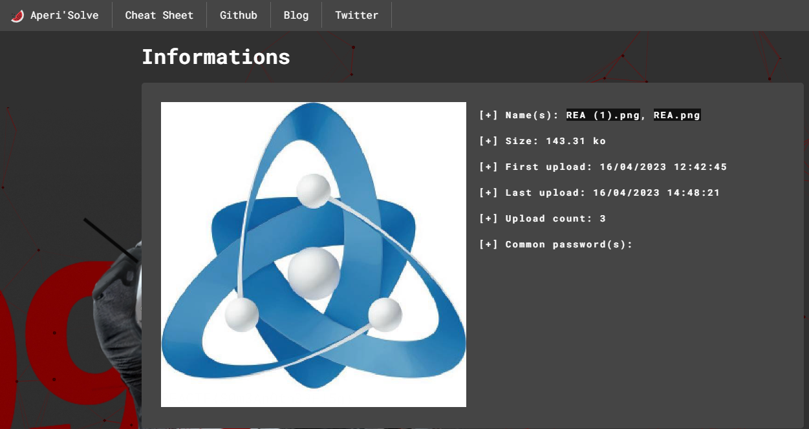

При просмотре различных цветовых каналов изображения, находим флаг:

Флаг: REACTF{S0m3An0th3RFl5g}

---

## Stego: Mysterious QR

Дано изображение с разноцветным QR-кодом:

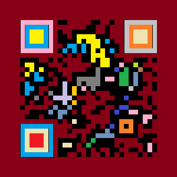

Переносим изображение в Paint и превращаем его в ч/б изображение:

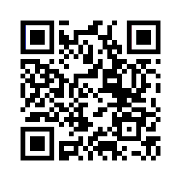

Затем считываем информацию:

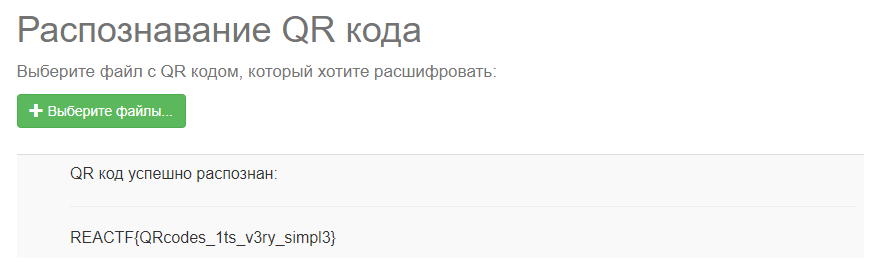

Флаг: REACTF{QRcodes_1ts_v3ry_simpl3}

---

## Stego: Take a toad

Дано изображение:

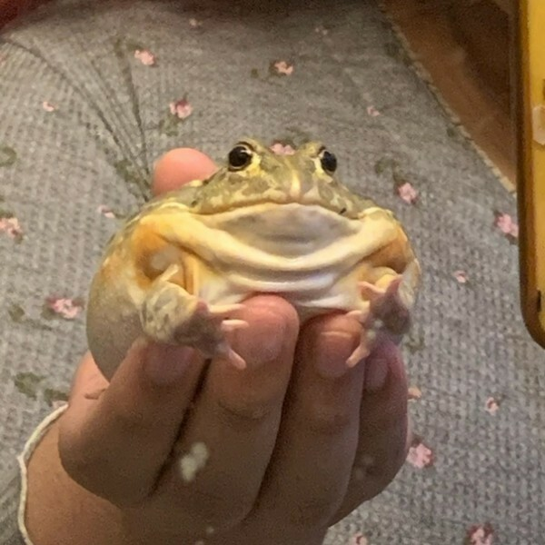

Проверяем его через Aperi'Solve и в разделе Zsteg находим флаг:

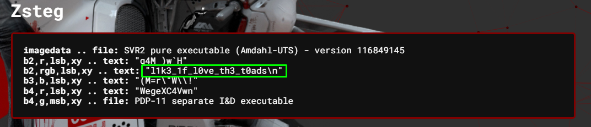

Флаг: flag{l1k3_1f_l0ve_th3_t0ads}

---

## Stego: Mint

Исходное изображение:

Через binwalk находим вложенный в изображение архив формата RAR:

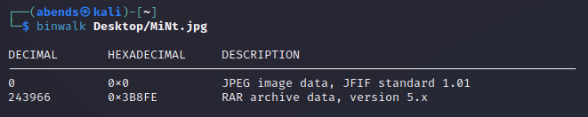

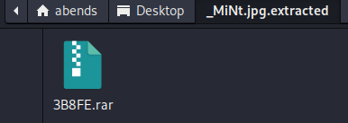

Далее получаем хэш при помощи rar2john, который будем брутить:

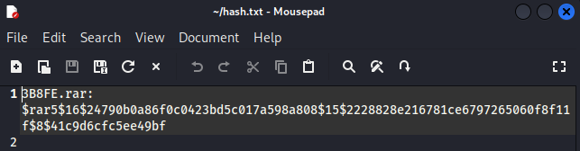

В архиве находится файл, который содержит в себе строку формата base64:

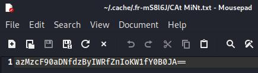

Декодируем ее и получаем флаг:

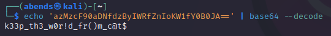

Флаг: flag{k33p_th3_w0r!d_fr()m_c@t$}

---

## Stego: 01010001001

Нам дан файл, внутри которого находятся 0 и 1:

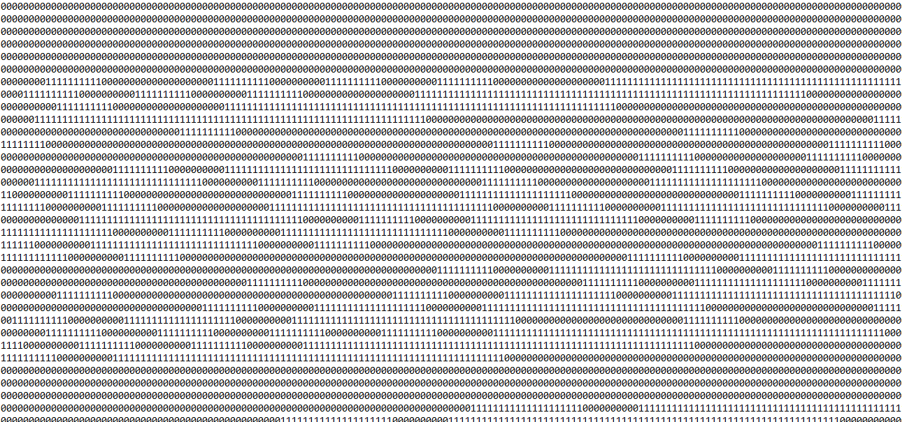

Формируем из имеющихся данных QR-код: 

Сканируем его и получаем флаг:

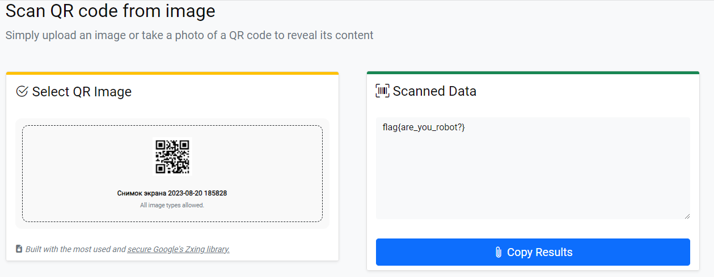

Флаг: flag{are_you_robot?}

---

## Crypto: Some RSA

Дано:
n=2575907945382619141476197046730769503363459
e=65567
c=612868338425011852037646590456016465505370

Декодируем RSA при помощи dCode.fr:

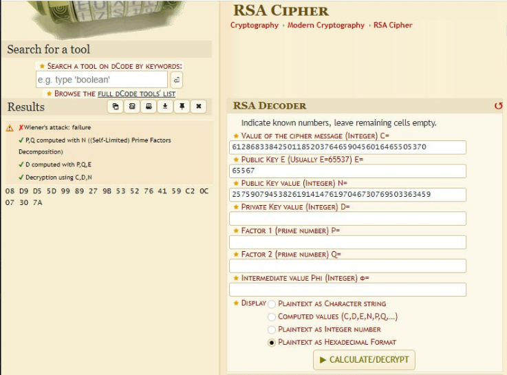

REACTF{0x8d9d55d9989279b5352764159c20c07307a}

---
## Stego: Your Favourite Salad

Дано обрезанное изображение:

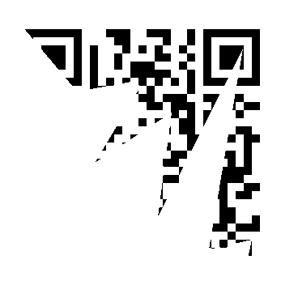

Через binwalk извлекаем архив:

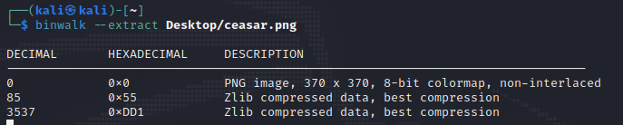

Получаем хэш и брутим:

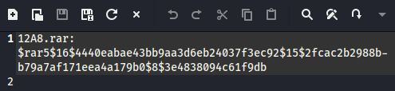

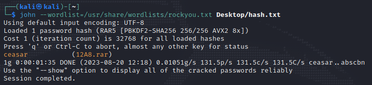

В архиве находим вторую часть QR-кода:

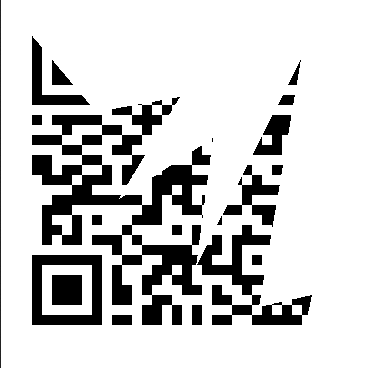

Соединяем два изображения и получаем целый QR

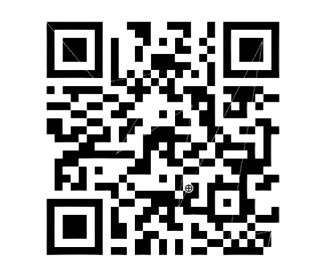

Читаем и забираем флаг:

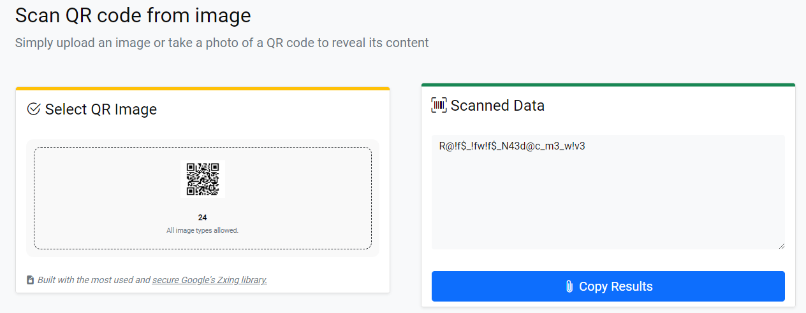

flag{R@!f$_!fw!f$_N43d@c_m3_w!v3}

---
