# Atom Skills Qualifying Stage 1/2 - Forensics

---

## Task 1: Network Traffic Dump №1
> Find the secret message in the network traffic

Откроем файл и среди всего прочего найдем перехваченные telnet-пакеты. Выберем "Следовать -> TCP-поток":

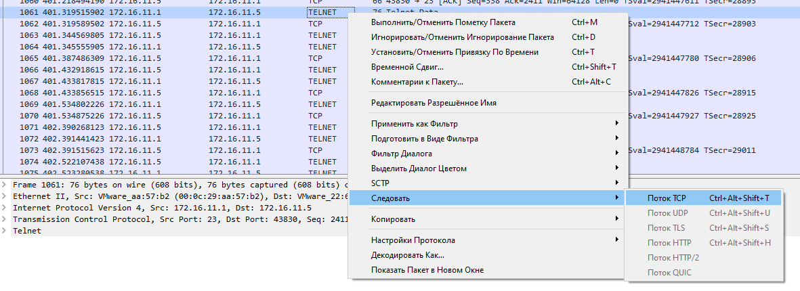

Перед нами открывается полная правильная последовательность пакетов, передаваемых по telnet. Из интересного можно сразу заметить **login: aaddmmiinn** и **password:  P@ssw0rd**

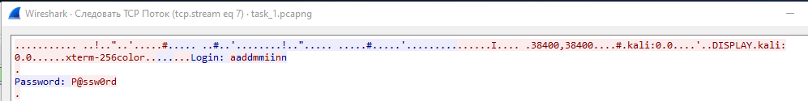

Но нам нужно найти секретное сообщение. Смотрим далее по потоку:

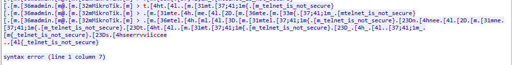

И вот мы находим то самое секретное сообщение: {\_telnet_is_not_secure}. Остается только добавить обертку и убрать один лишний символ "\_".

Flag is: ***flag{telnet_is_not_secure}***

---

## Task 2: Network Traffic Dump №2
> What is the password for admin?

Открываем дамп и, немного осмотревшись, находим траффик, передаваемый по протоколу FTP. Выберем "Следовать -> TCP-поток":

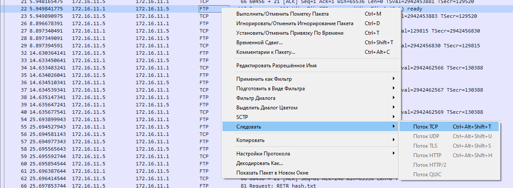

Откроется полная последовательность действий, в том числе будут видны **login: admin** и **password: very_strong_password**

Flag is: ***very_strong_password***

---

## Task 3: Network Traffic Dump №3
> Какой файл удалось найти злоумышленнику?

При открытии дампа можно заметить, как, скорее всего, gobuster, пытается пытается найти, существующие на веб-ресурсе, директории:

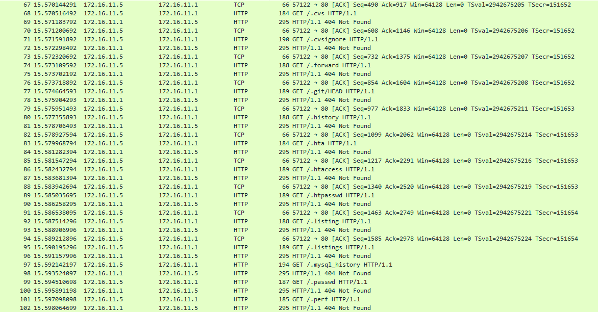

Для того, чтобы найти директории, которые действительно существуют, введем фильтр, который будет показывать только успешные (code 200) ответы - ***http.response.code==200***

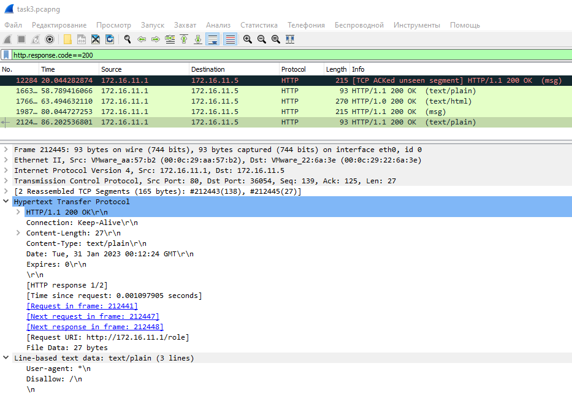

Открыв один из пакетов, видим, что в разделе "Lined-based text data" есть шаблон, который соответствует файлу **robots.txt**.

Flag is: ***robots.txt***

---

## Task 4: Network Traffic Dump №4
> Опишите инцидент:
> 1. Назовите атаку, которую провел злоумышленник
> 2. Назовите адрес, с которого была атака
> 3. Назовите адрес жертвы
> Формат флага: attack;xxx.xxx.xxx.xxx;xxx.xxx.xxx.xxx;

Для подобного рода тасков, которые также будут представлены далее, будем обращаться к ресурсам, где расположены примеры и описание сетевых атак на примере дампов траффика в WireShark:
https://kb.mazebolt.com/kbe_taxonomy/layer-4/ (один из ресурсов)

Сразу, что бросается в глаза - наличие огромного количества "echo (ping) request"

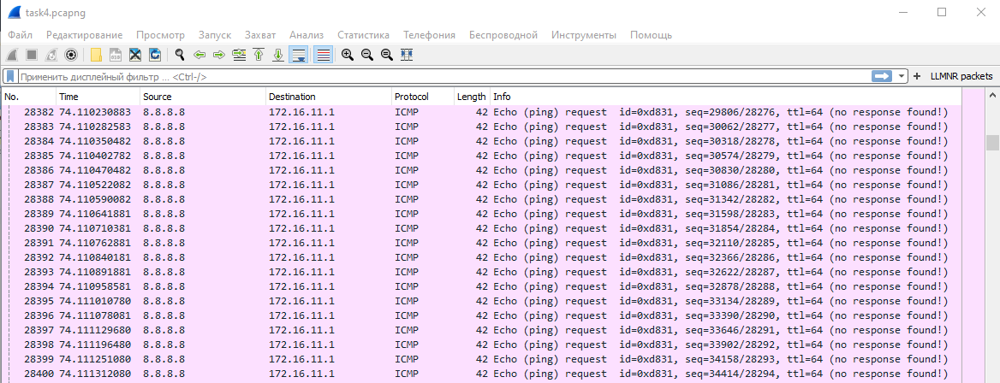

Flag is: ***icmp_flood;8.8.8.8;172.16.11.1;***

---

## Task 5: Network Traffic Dump №5
> Опишите инцидент:
> 1. Назовите атаку
> 2. Назовите адрес, с которого проводили атаку
> 3. Назовите адрес жертвы
> 4. Назовите протокол, которым злоупотребляли
> Формат флага: answer1;answer2;...;

Здесь обращаем внимание на наличие пакетов UDP

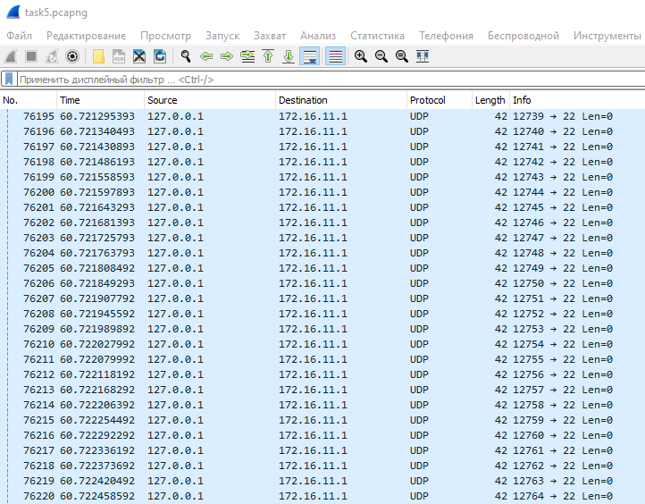

Flag is: ***udp_flood;127.0.0.1;172.16.11.1;udp;***

---

## Task 6: Network Traffic Dump №6 (not solved)

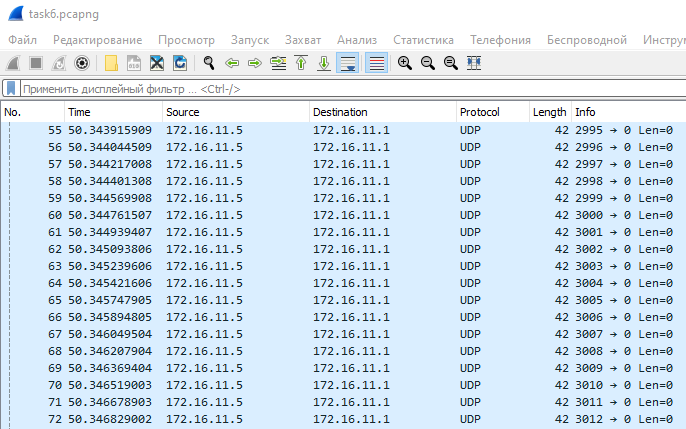

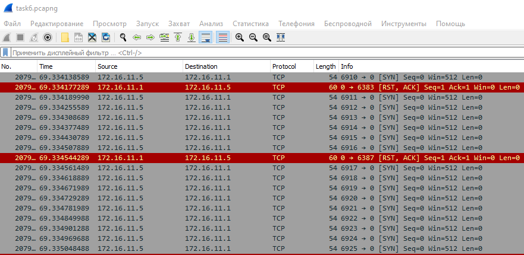

Flag is: syn_flood,udp_flood;172.16.11.5;172.16.11.1;tcp,udp;

---

## Task 7: Network Traffic Dump №7
> Опишите атаку: 
> 1. Назовите ее тип 
> 2. Назовите атакованный порт
> Формат флага: attack_ssh;22

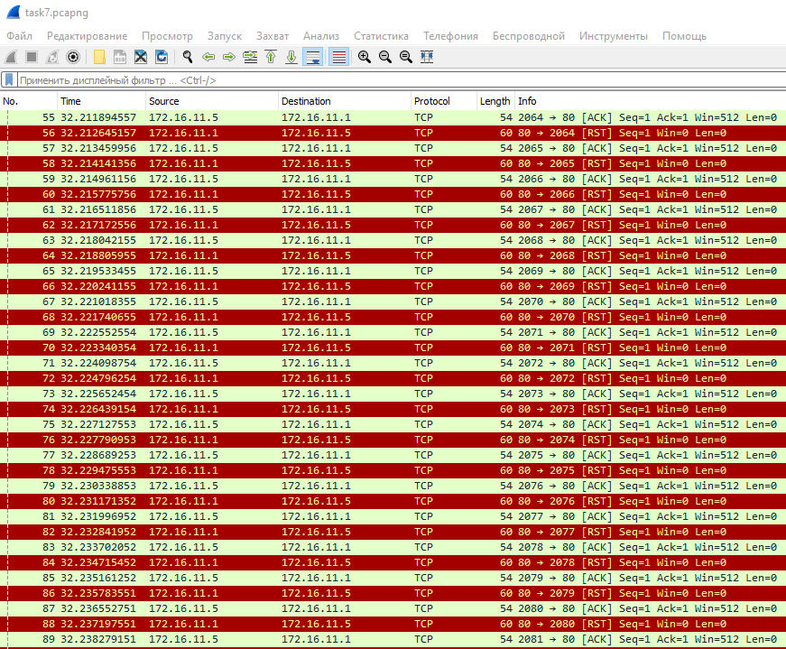

Flag is: ***ack_flood;80***

---

## Task 8: Network Traffic Dump №8

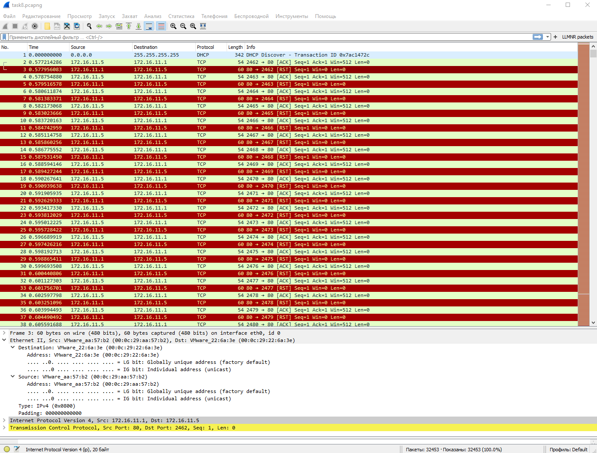

Flag is: ***00:0c:29:aa:57:b2;172.16.11.1;***

---

## Task 9: Memory Dump of Windows №1
> С помощью команды malfind определите первый подозрительный процесс, назовите его имя и PID
> Выясните сколько УЗ было на компьютере

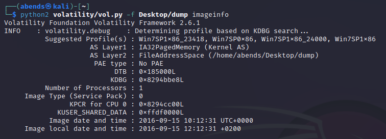

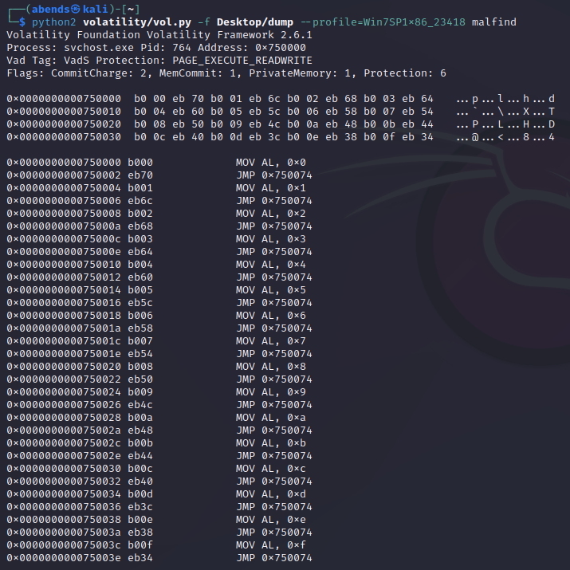

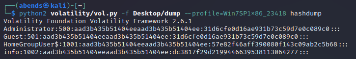

Flag is: ***svchost.exe;pid:764;4;***

---

## Task 10: Memory Dump of Windows №2

---
