# KPK CTF FOR BEGINNERS

## Crypto 1: Раскопки в Риме
На раскопках в Риме мы нашли древнее послание, сможешь помочь нам расшифровать его? - **fh_hizvsbal**

Город «Рим» сразу намекает нам о шифре Цезаря:

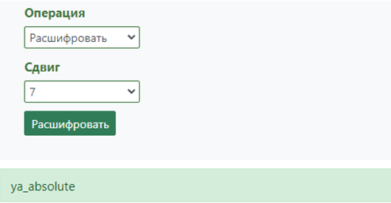

Flag: CTF{ya_absolute}

## Crypto 2: Только 64...
Только 64… - **Q1RGX21vOV9sdUJvdmJfbmF2c2VnZGE=**

В самом задании есть хинт – 64, что означает только одно – кодировка base64, дешифруем:

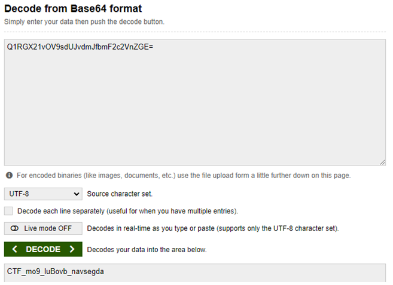

Flag: CTF{CTF_mo9_luBovb_navsegda}

## Crypto 3: Танаха
**НМК_ЬРЫ_ЦУЦ_ЬЛЫ** - был найден древнееврейский текст Библии / Танаха.

Уже поинтереснее, поэтому гуглим:

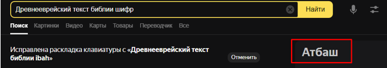

В декодер:

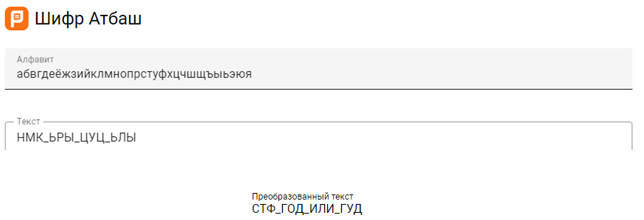

Flag: CTF{СТФ_ГОД_ИЛИ_ГУД}

## Crypto 4: le chiffre
Ого, мне на почту пришло письмо от Летней школы CTF, но похоже, что оно зашифровано *le chiffre indéchiffrable* - так прозвали данный шифр. Что же в нем зашифровано?
**bu_rxvrx_wzi**

Фраза «le chiffre indechiffrable» дает понять, что есть связь с францией, а кто у нас является французом, который придумал какой-нибудь шифр? Правильно – Блез Виженер! А какой шифр он придумал?)

Самое интересное, что ключ нам не дан, но учитывая этот факт, можно предположить, что он простой, поэтому пробуем – kpk, flag, ctf…

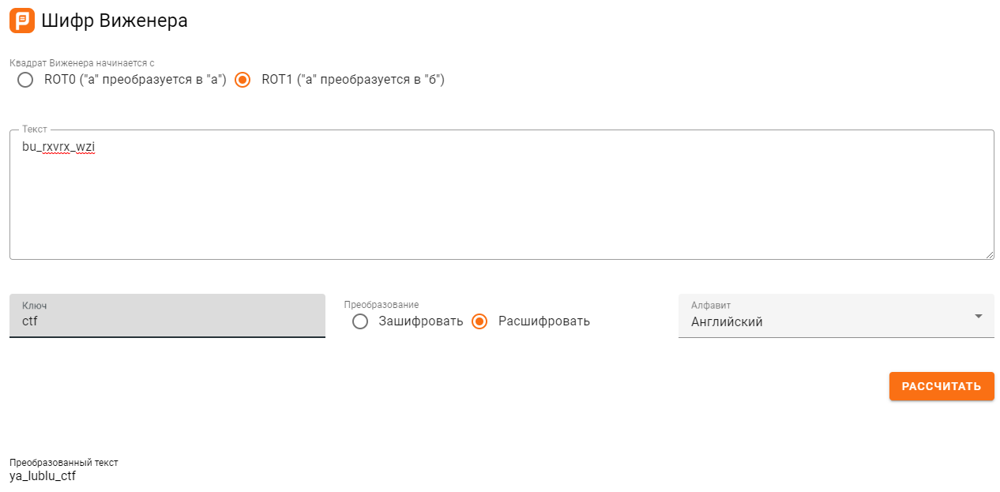

Flag: CTF{ya_lublu_ctf}

## Crypto 5: Нотный шифр
Какой-то умный или не очень-музыкант-шпион решил передавать секреты в нотах

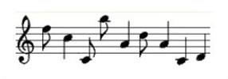

Находим нотный декодер на сайте: https://www.dcode.fr/

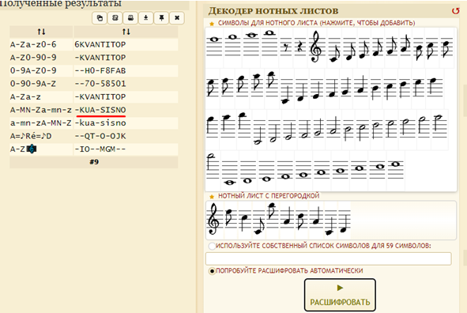

Flag: CTF{KUA-SISNO}

## Stego 1: on my puter
Этот котик-джун еще совсем новичок в программировании, но он уже усвоил одно важное правило: если он видит что-то интересное, но непонятное - он это гуглит. Кто знает, может это правило поможет и тебе…

Используем очень хороший онлайн-инструмент, способный решать стегу, а точнее – показывать артефакты в изображениях: https://www.aperisolve.com/ 

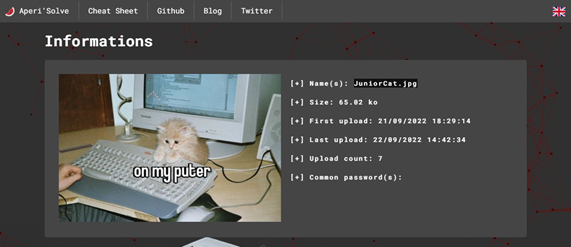

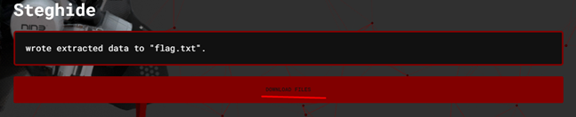

Как видим, при помощи steghide скрыт файл. Получаем архив из изображения, в котором находим заветный текстовый файл:

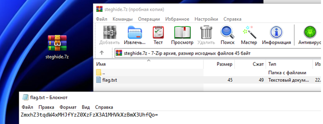

Видим знакомый нам уже base64, пробуем декодировать:

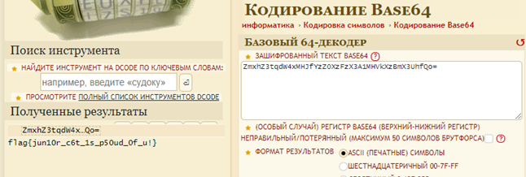

Flag: flag{jun10r_c6t_1s_p50ud_0f_u!}

## Stego 2: hedgehog
Этот маленький бандит спрятал от вас флаг. Найдите его.

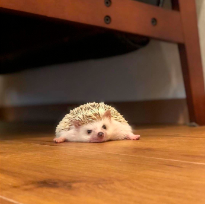

Для начала смотрим, что это за файл и узнаем его реальное расширение, через онлайн-инструмент. После этого переименуем исходный файл, сделав расширение .zip. Далее открываем архив:

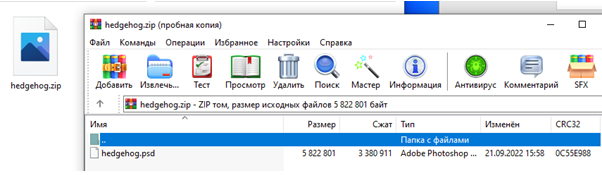

Видим, что в архиве лежит файл с расширением .psd, которым обозначаются photoshop-файлы. Открываем данный файл в photoshop:

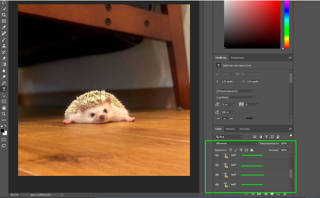

Далее смотрим на слои в изображении и замечаем, что там есть слои с текстом, правда у них сбит шрифт, но просто нажимаем на знак предупреждения и шрифт поменяется. Просматриваем таким образом слои, предварительно убрав фон. Все слои, за исключением одного имеют одинаковое наполнение – Lorem ipsum. Но среди этого находим следующее:

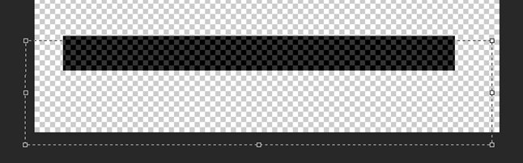

Копируем этот текст в блокнот и получаем флаг!

Flag: CTF{th3_h3dg3h0gg_0n_th3_fl00r}

## Stego 3: Звук = флаг
Есть звук - нужно получить флаг. Проще не бывает!

Простое прослушивание аудио-файла не дало результатов, что ожидаемо, поэтому пробуем посмотреть файл через Spectrum Analyzer: https://audiotoolset.com/ru/spectral-analysis

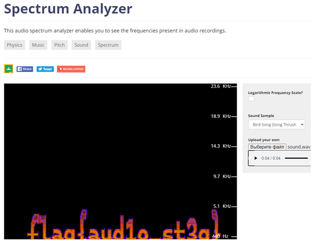

Flag: flag{aud1o_st3g}

## Stego 4: Шум
На втором (третьем?) дыхании

Используем уже известный нам ресурс для подробного исследования изображений:

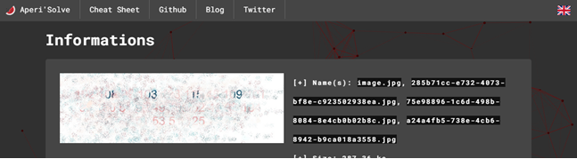

В одном из разделов находим следующее изображение, где различимы цифры:

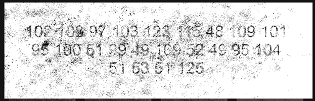

Переносим цифры в dcode и анализируем шифр:

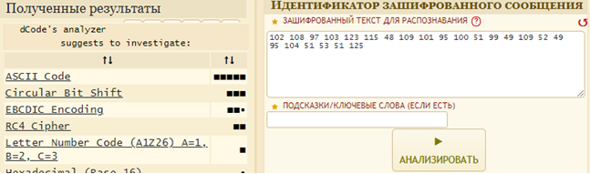

Декодируем через ASCII-конвертер:

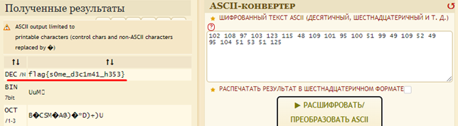

Flag: flag{s0me_d3c1m41_h353}

## Stego 5: DTMF
Кажется, эти звуки что-то значат, вот только что?

Забегая вперед, на мой взгляд, это самый интересный таск на данном CTF. Ух, сколько же пришлось гуглить... Сначала таск вообще был не понятен. Да, в аудио-файле были разные звук нажатия клавиш, но вот, что с этим делать – не понятно было. В итоге, узнаем, что это DTMF (Dual-Tone Multi-Frequency) или же тональный сигнал - это система сигналов для идентификации клавиш или, лучше сказать, номера, набранного с помощью кнопок. Ключевым здесь является идентификация клавиш, именно поэтому звуки разные. Соответственно, узнаем, что за цифры были набраны при помощи инструмента с GitHub: https://unframework.github.io/dtmf-detect/ 

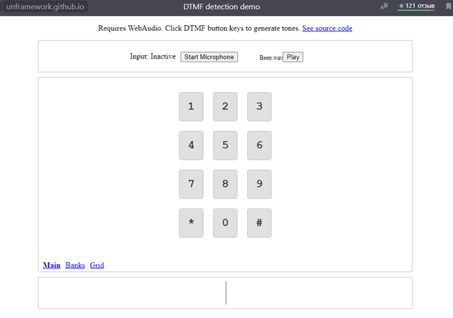

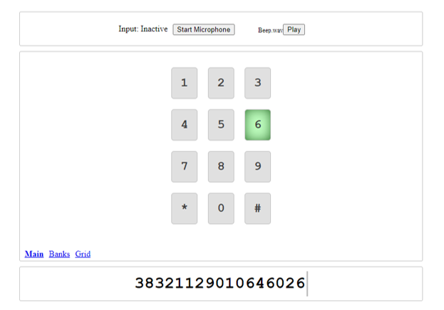

В итоге получаем следующую последовательность: 38321129010646026775667524568731937297426408950428285

Казалось бы, вот сейчас мы найдем флаг, но нет, с цифрами нужно немного поработать. Но как decimal преобразовать в текст? Правильно, через hex:

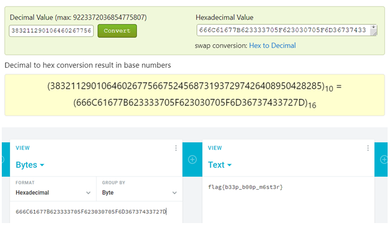

Flag: flag{b33p_b00p_m6st3r}

## Stego 6: colors
Любителям уцуцуги - welcome

Нам дана "строка", состоящая из разных цветов:

Погуглив, узнаем, что цвета можно представить в hex-формате, а, как мы уже знаем, hex можно преобразовать в текст. Пробуем! Используем онлайн-определитель цветов:

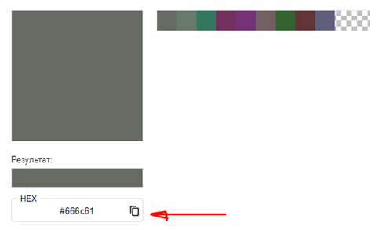

Получаем: #666c61 #677c68 #2f795f #752c5f #753079 #755f64 #2f632c #643032 #5f5f7e. Эти данные преобразуем в текст:

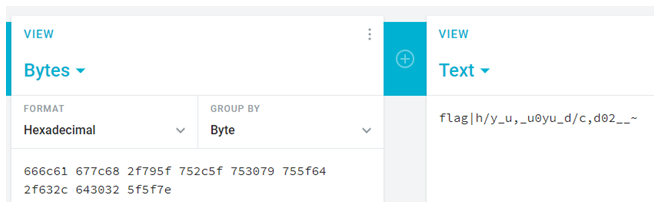

В итоге, что-то пошло не так… Проверял и через другие онлайн-конверторы, и в других дешифровщиках, но тщетно… После долгих скитаний заходим в Photoshop, уж он точно правду покажет:

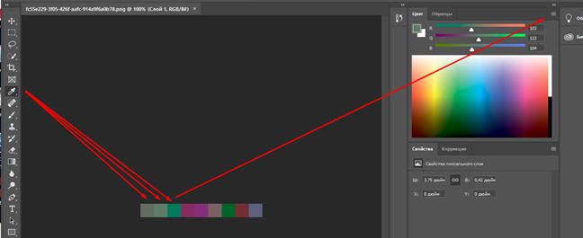

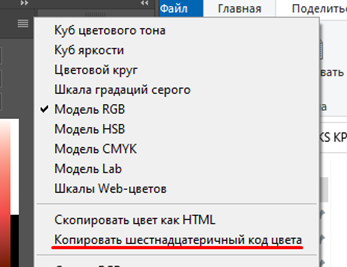

Пересмотрим hex-значения: #666c61 #677b68 #33785f #74305f #743378 #745f64 #336330 #643335 #5f5f7d. .И тут замечаем, что значения различаются! Проверяем новые:

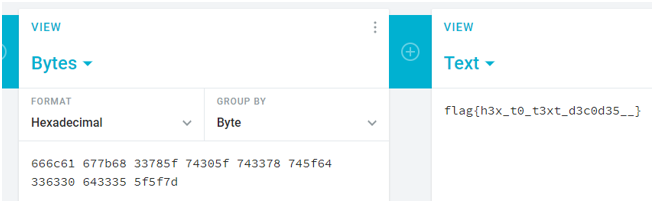

Flag: flag{h3x_t0_t3xt_d3c0d35__}

## Stego 7: Whitespace
Любителям уцуцуги - welcome еще раз!

Нам дали файл, в котором находится последовательность из слов TAB и SPACE:

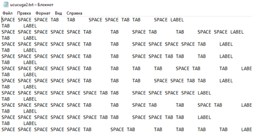

Снова гуглим:

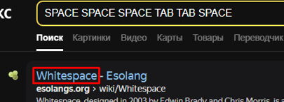

Перейдя на сайт, можно узнать, что это целый язык программирования, поэтому находим интерпретатор для него:

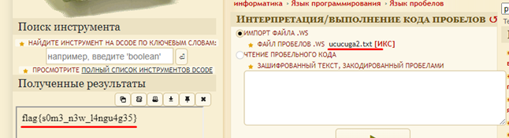

Flag: flag{s0m3_n3w_l4ngu4g35}

## Web 1: URL code
Дана некая последовательность символов:

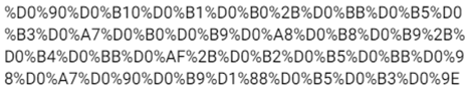

В этом таске примитивчик – URL-code:

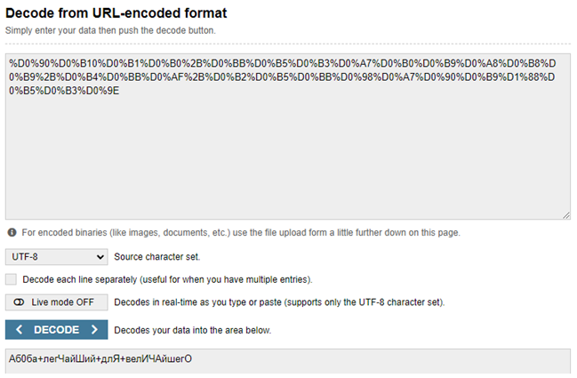

Flag: flag{Аб0ба+легЧайШий+длЯ+велИЧАйшегО}

## Web 2: See some?
dom не связан с жильем. На белом листе нашли маленькую точку, и она сильно мешает заказчику. Было бы неплохо если бы ты тоже нашел ее.

Переходим по ссылке и на первый взгляд, ничего интересного, просто пустая страница, поэтому заходим в инспектор и анализируем код страницы:

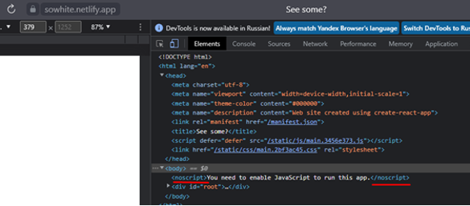

Среди всего прочего, находим скрытую кнопку на странице и нажимаем на нее:

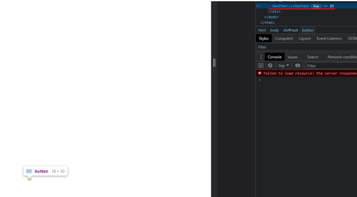

В итоге в уведомлении лежит флаг:

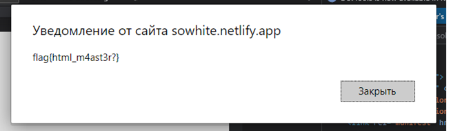

Flag: flag{html_m4ast3r?}

## Reverse 1: Потерянный исходник
Наш SSS криптер Данила написал программу, чтобы поздравить всех с новым 2022 годом , но к сожалению перепутал год и потерял исходник… Помогите Даниле исправить код программы !

Решить данный таск можно несколькими способами. Первый заключался в угадывании «пароля» (года), что в принципе не самое целесообразное занятие (хоть и год 2022), поэтому открываем IDA Pro:

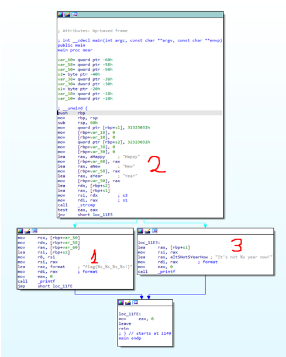

Flag: flag{Happy_New_Year_2022!}

## Reverse 2: many many folders
Когда то в 2008 году я купил 100 биткоинов и решил спрятать их подальше, не могли бы вы помочь найти мой кошелек?

В этом таске тоже есть разные способы решения. Я же сначала выбрал наиболее долгий и сложный:

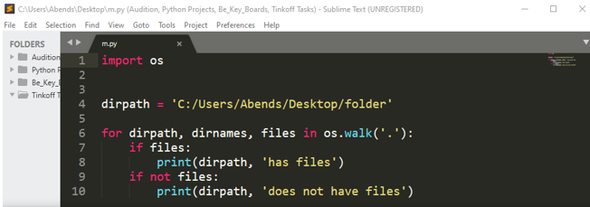

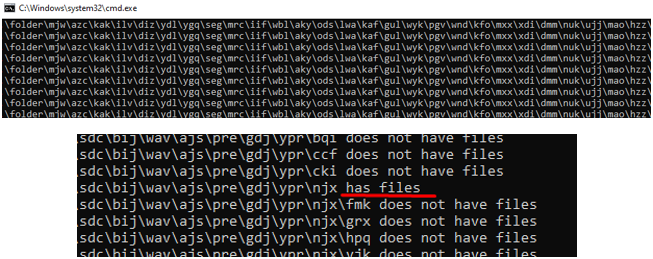

Находим директорию с флагом:

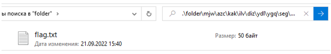

Несмотря на это, таск я сделал и флаг нашел, но потом я узнал более изящный способ:

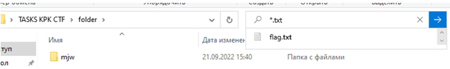

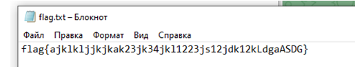

Flag: flag{ajklkljjkjkak23jk34jkl1223js12jdk12kLdgaASDG}

## Reverse 3: Пароль
Когда я в очередной раз лежал у камина с кружкой горячего чая , я решил сохранить флаг в архиве и успешно забыл от него пароль … Помогите же мне достать флаг? Все что я помню - пароль состоял из 8 цифр.

Паролем оказался – 20222022, его можно перебрать, учитывая, что пароль состоит из 8 цифр. Перебираем пароль при помощи сторонних инструментов для взлома паролей на архиве.

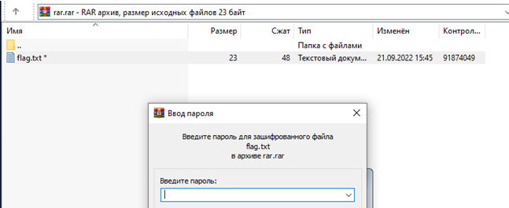

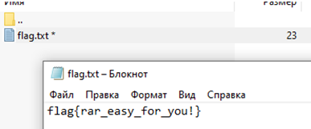

Flag: flag{rar_easy_for_you!}

## OSINT 1: Интернет-газета
Назовите название интернет-газеты

P.S. Не стесняйтесь использовать все возможности Google Maps;)

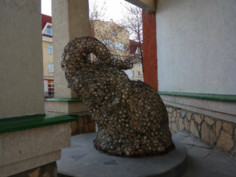

Находим эту картинку через «Поиск по фото», определяем местоположение статуи:

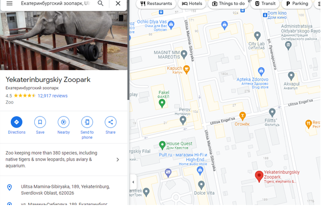

Далее, исходя из подсказки в описании, используем Google Maps и осматриваемся:

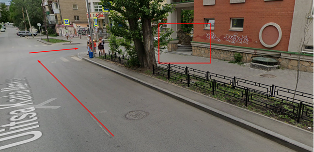

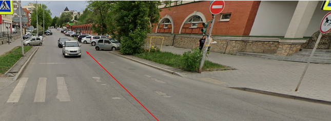

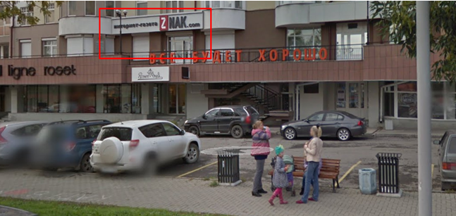

Flag: CTF{ZNAK.com}
