# KPK CTF MIDDLE

## Crypto 1: Crypto 7
Описание: try try try try try try try

Дано:
Vm0wd2VFNUdiRmRXV0doVVYwZG9XRll3Wkc5V1ZsbDNXa1JTV0ZKc2JETlhhMUpUVmpBeFYySkVUbGhoTVhCUVZtcEtTMU5IVmtWUmJVWlhWbXhzTTFkV1dtRlpWMDE0V2toR1UySklRazlWYlhoM1pWWmFkR05GU214U2EzQllWVzAxUjFadFNrZFhhemxYWWxSV1JGbHFSbUZrUlRGVlZXeFdUbFpZUWxsV1Z6RTBWakpHU0ZadVJsSldSM001

Через анализатор узнаем, что это Base64:

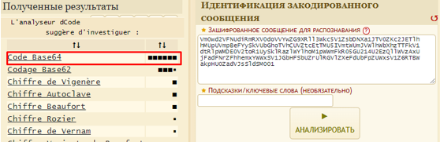

Далее декодируем эту строку, причем несколько раз (try try try), при этом сообщение уменьшается в длине:

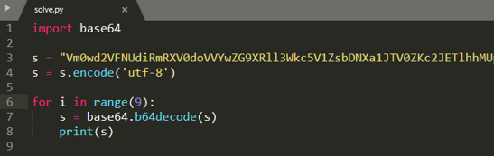

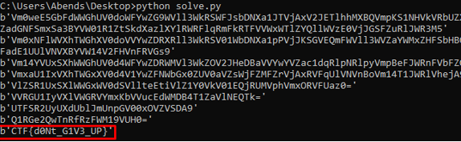

Flag: CTF{d0Nt_G1V3_UP}

## Crypto 2: Crypto 8
Описание: Сможешь ли ты найти среди рандомных данных флаг?

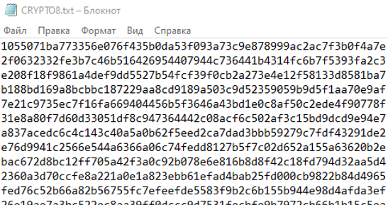

Смотрим, что это в dCode:

Декодируем. Создаем файл, куда будет записан результат декодирования:

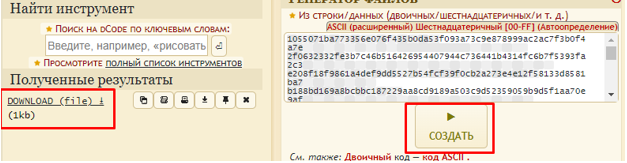

Созданный файл читаем при помощи все того же инструмента:

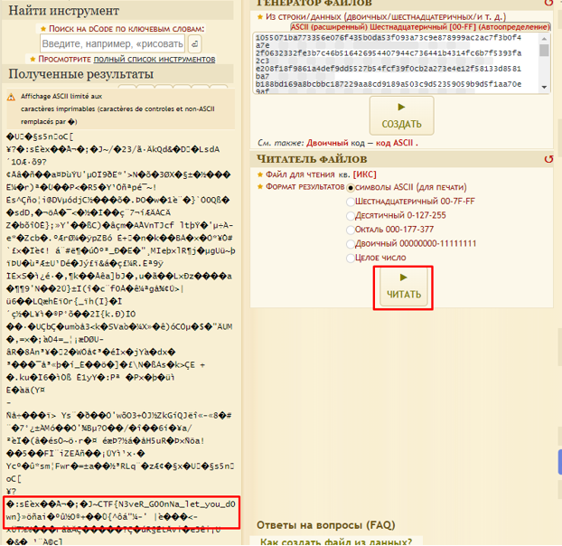

Flag: CTF{N3veR_G00nNa_let_you_d0wn}

## General Skills 1: GeneralSkills 1
Описание: Вы слышали что-то про «netcat»? nc XXX.XXX.XXX.XXX 10004

netcat - это сетевая утилита, предназначенная для исследования и отладки сети. Netcat позволяет создавать соединения TCP или UDP и обмениваться данными через них.

Подключаемся к узлу:

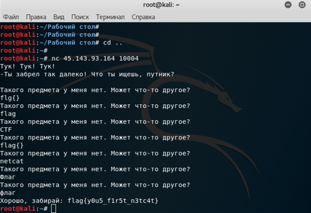

После нескольких попыток получаем то, что искали.

Flag: flag{y0u5_f1r5t_n3tc4t}

## General Skills 2: GeneralSkills 2
Описание: Мы открыли свой магазин, где собираемся продавать флаги! Успей, пока все не раскупили! nc XXX.XXX.XXX.XXX 10005

Помимо того, что нам дана информация по подключению, у нас есть файл store.c. Открыв его, можно понять, что это обычная консольная программа, написанная на C.

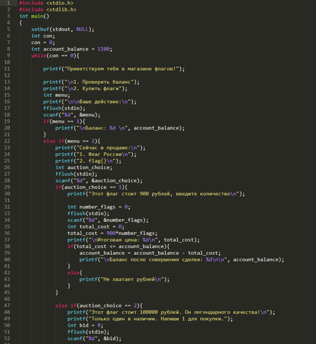

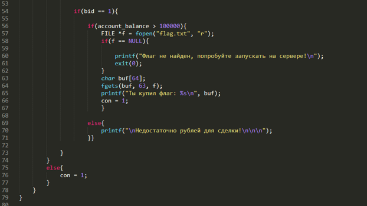

Проанализировав код, можем понять, что в нем есть несколько простых вложенных условий. Будем идти параллельно с netcat. В начале видим, что есть два действия – «Проверить баланс» и «Купить флаги». Выбираем второе, и смотрим, что есть в наличии:

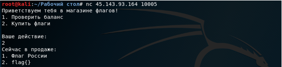

Нам в любом случае, нужен flag{}, но у нас на него нет средств, поэтому нужно придумать, "как получить больше денег! На «Флаг России» у нас есть средства, вот только при его обычной покупке, денег у нас станет меньше, а результата никакого не получим. Надо посмотреть внимательно на код:

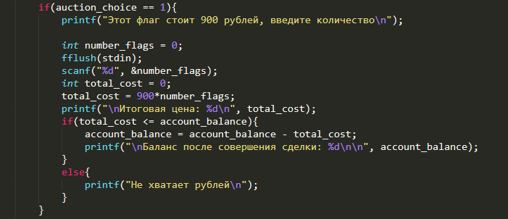

Что можно заметить? Да на самом деле очень интересную вещь – total_cost является значением выражения 900 * number_flags. Соответственно, если программа пойдет дальше с положительным значением number_flags, то total_cost будет больше, чем account_balance, поэтому мы попадаем в ситуацию, когда у нас недостаточно средств.

Но обратим внимание на строку: account_balance = account_balance – total_cost. Это же получается, что, если total_cost будет иметь отрицательное значение, то от переменной account_balance не будет отниматься число, а, наоборот, добавляться (минус на минус – даст плюс).

А как же сделать total_cost отрицательным? Мы помним, что total_cost = 900 * number_flags, тогда нам нужно вводить количество флагов отрицательное. Попробуем:

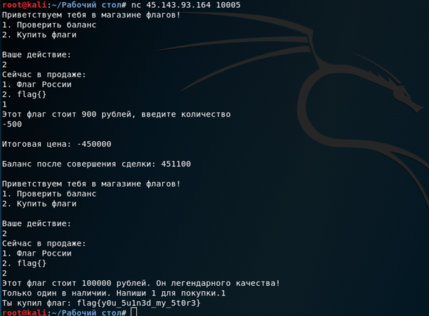

Как видим, баланс положительный и огромный, поэтому лутаем флаг! 

Flag: flag{y0u_5u1n3d_my_5t0r3}.

## Stego 1: Восстановление файла
Описание: Очередная попытка спрятать информацию не привела ни к чему хорошему...

Скачиваем архив, в котором присутствует несколько файлов, пронумерованных от 0 до 5. Откроем несколько из них и наткнемся на это:

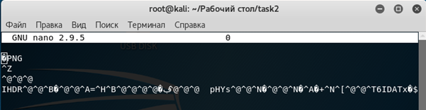

Получается, что эти файлы являются частями к одному файлу, а именно – png-файлу, что видно на рисунке выше. В таком случае объединим эти файлы, а результат занесем в новый (файл 6):

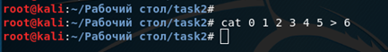

Открываем полученный файл:

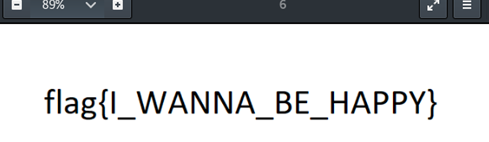

Flag: flag{I_WANNA_BE_HAPPY}

## Stego 2: Ryoiki tenkai!
Описание: Ryoiki tenkai!

Так, в общем-то описание не понятно от слова совсем, поэтому гуглим:

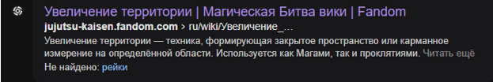

Хм, увеличение границ, запомним. Посмотрим файл, который прикреплен к заданию:

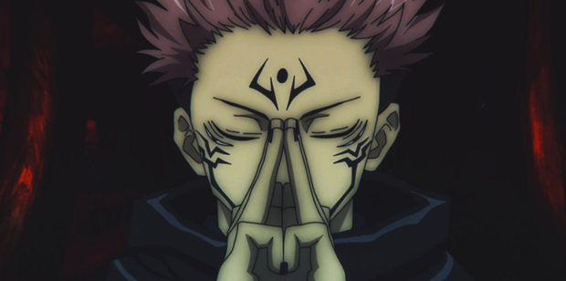

Попробовал посмотреть картинку через aperisolve, но результата особого не увидел. Из интересного только тот факт, что файл сжат:

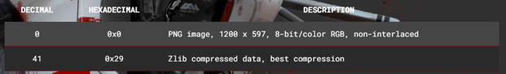

До этого не сразу можно дойти, но, получается, что нужно как-то увеличить изображение. Это было понятно, но вот как это сделать, предстояло выяснить. Вновь гуглим:

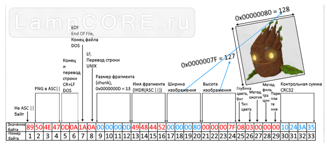

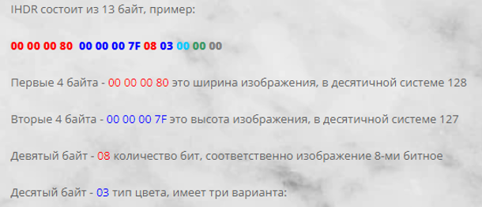

Т.е. исходя из полученной информации по hex-структуре png-файла, можно сделать вывод о том, что мы можем поменять определенные hex-значения, для того, чтобы поменялись размеры изображения. Пробуем. Для начала разберемся со структурой заголовка нашего файла:

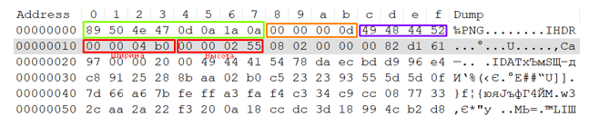

Соответственно, если перевести 04b0 в десятичную систему счисления, получим 1200. Если переводить 0255, то получаем 597, следовательно, 1200х597. Проверим, правильно ли мы определены размеры:

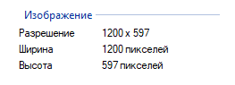

Да, мы все правильно определили. Далее, меняем на размеры в большую сторону:

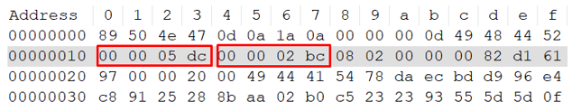

Теперь размеры нашего изображения составляют: 1500х700. Сохраняем и смотрим на изображение:

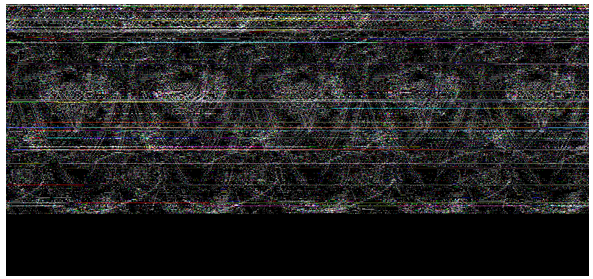

Хм, странно. Попробуем изменить только один параметр (высоту):

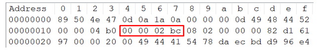

Вновь открываем изображение:

Flag: flag{Ar3_y0u_Sat0ru??}

## Web 1: True Web
Переходим по ссылке и видим следующее:
 

Пробуем выбирать правильные ответы, но в итоге сталкиваемся с трудностями в «JS-блоке». Нажатия на кнопки ничего не дают. Посмотрим на код страницы:

Видим, что у третьей кнопки нет функции, которая вызывается при нажатии. Но может быть ответ (answer3) все же есть? Потому как в JS на сайте все прописано:

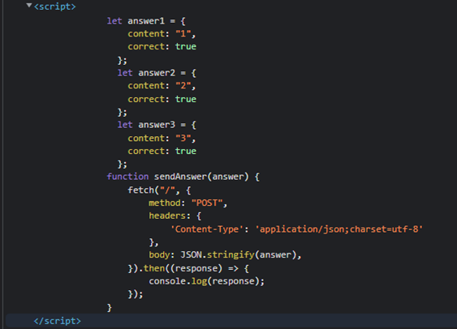

Проверим:

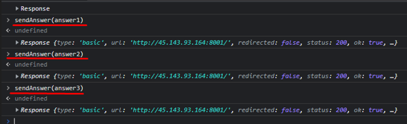

При отправке sendAnswer(answer3) получаем в ответе 200, что в нашем случаем означает «успех». В частности, код “200 ОК” говорит пользователю, что его запрос успешно выполнен. Например, клиент запросил те или иные данные. Ответ сервера 200 означает, что эти данные отображены в заголовке или сообщении.

Так вот и посмотрим, что мы получили в ответе:

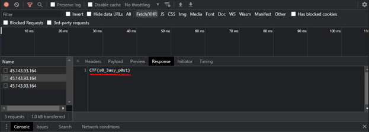

Flag: CTF{s0_3asy_p0st}
