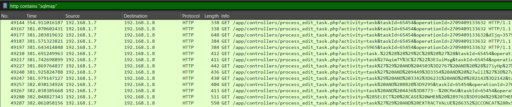
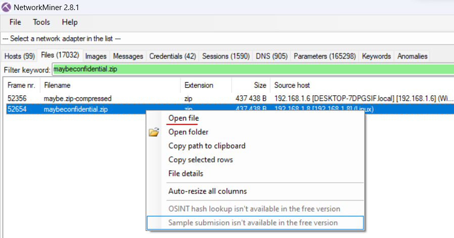

# KnightCTF 2024

---

### Digital Forensics 1: OS

```sh
Description:

My boss, Muhammad, sent me this dump file of a memory. He told me that this OS has a malware virus that runs automatically. I need to find some more information about this OS, and the hacker also created some files in this OS. He gave me a task to solve this within 24 hours. I am afraid. Will you please help me? My boss sent some questions; please solve them on my behalf. There are total 7 challenges in this series. Best of luck.

What is the OS version?

Flag Format: KCTF{1.1.1111.11111}
```

Выявляем профиль и версию ОС:


Пометочка - по какой-то не понятной причине плагин imageinfo отдает неверные приближенные значения профилей ОС:


`KCTF{7.1.7601.24214}`

---

### Digital Forensics 2: IP Addr

```sh
Description:

What is the IP address of this system?

Please use the attachment of the first challenge.

Flag Format: KCTF{127.0.0.1}
```

Команда для исследования сетевых подключений (используем плагин netscan):

```sh
vol2.exe -f KnightSquad.DMP --profile=Win7SP1x64 netscan
```

Вариантов не много, кроме 10.0.2.15 больше никаких IP-адресов нет


`KCTF{10.0.2.15}`

---

### Digital Forensics 3: Password

```sh
Description:

What is the login password of the OS?

Please use the attachment of the first challenge.

Flag Format: KCTF{password}
```

Для получения хэшей паролей применяем плагин hashdump:

```sh
vol2.exe -f KnightSquad.DMP --profile=Win7SP1x64 hashdump
```


Через CrackStation находим пароль:

```sh
7ab3201ceecd554f772573bb064a0f38 (NTLM) - squad
```


`KCTF{squad}`

---

### Digital Forensics 4: Note

```sh
Description:

My boss has written something in the text file. Could you please help me find it?

Please use the attachment of the first challenge.

Flag Format: KCTF{something_here}
```

Получаем список файлов системы с помощью плагина filescan:

```sh
vol2.exe -f KnightSquad.DMP --profile=Win7SP1x64 filescan
```


Сохраняем вывод в файл для дальнейшего удобства исследования (filepaths.txt). Среди файлов находим директории пользователя siam. Постепенно сужаем круг поиска файлов. Сначала делаем grep относительно файлов пользователя `siam`, а затем находим следующие файлы:


Таким образом мы обнаружили два текстовых файла. Дампим их при помощи плагина dumpfiles:

```sh
vol2.exe -f KnightSquad.DMP --profile=Win7SP1x64 dumpfiles --dump-dir=./ -Q 0x00000000b9d1ef20

vol2.exe -f KnightSquad.DMP --profile=Win7SP1x64 dumpfiles --dump-dir=./ -Q 0x00000000b9ba7bb0
```


Файл text2.txt имеет следующее содержимое:


Декодируем из base64 найденный текст:

```sh
S0NURntSZXNwZWN0X1kwdXJfSGVyNG5raX0= - KCTF{Respect_Y0ur_Her4nki}
```

`KCTF{Respect_Y0ur_Her4nki}`

---

### Digital Forensics 5: Execution

```sh
Description:

y leader, Noman Prodhan, executed something in the cmd of this infected machine. Could you please figure out what he actually executed?

Please use the attachment of the first challenge.

Flag Format: KCTF{Fl4g_h3re}
```

Чтобы посмотреть, что именно было сделано пользователем через консоль, необходимо воспользоваться плагином consoles:

```sh
vol2.exe -f KnightSquad.DMP --profile=Win7SP1x64 consoles
```


Находим запущенный файл `windows.bat`, который просто выводит нужный флаг:

`KCTF{W3_AR3_tH3_KniGHt}`

---

### Digital Forensics 6: Path of the Executable

```sh
Description:

What is the path folder of the executable file which execute privious flag?

Please use the attachment of the first challenge.

Flag Format: KCTF{D:\Program Files\Windows\here}
```

Это задание основано на основе предыдущего - нам нужна директория файла `windows.bat`

`KCTF{C:\Users\siam\Documents}`

---

### Digital Forensics 7: Malicious

```sh
Description:

What is the malicious software name?

Please use the attachment of the first challenge.

Flag Format: KCTF{Software.Extentention}
```

Здесь мы просто вновь анализируем файлы (filescan) в системе и находим интересный исполняемый файл - `MadMan.exe`, который является вредоносным:


`KCTF{MadMan.exe}`

---

### Web 1: Levi Ackerman

```sh
Description:

Levi Ackerman is a robot!

N:B: There is no need to do bruteforce.
```




`KCTF{1m_d01n6_17_b3c4u53_1_h4v3_70}`

---

### Web 2: Kitty

```sh
Description:

Tetanus is a serious, potentially life-threatening infection that can be transmitted by an animal bite.

N:B: There is no need to do bruteforce.
```


`KCTF{Fram3S_n3vE9_L1e_4_toGEtH3R}`

---

### Web 3: README

```sh
Description:

Read me if you can!!

N:B: There is no need to do bruteforce.
```


`KCTF{kud05w3lld0n3!}`

---

### Web 4: Gain Access 1

```sh
The web challenges are very much similar to real life application bugs. This is going to be a series of Gain Access with 3 challenges unlocks upon solving one by one. By solving these challenges, you'll gain a practical knowledge of Authentication Bypass Vulnerabilites as well as business logic error. The only difference is you'll not get any bounty but you'll get flags. Give it a try. And keep in mind, Don't make it hard, keep it simple. All the best. Solve the challenges & be a cyber knight.

No need to bruteforce. There's a rate limit. If you send continuous requests, you'll be blocked for 3 minutes.
```





```sh
' OR '1'='1
```


`KCTF{ACc0uNT_tAk3Over}`

---
