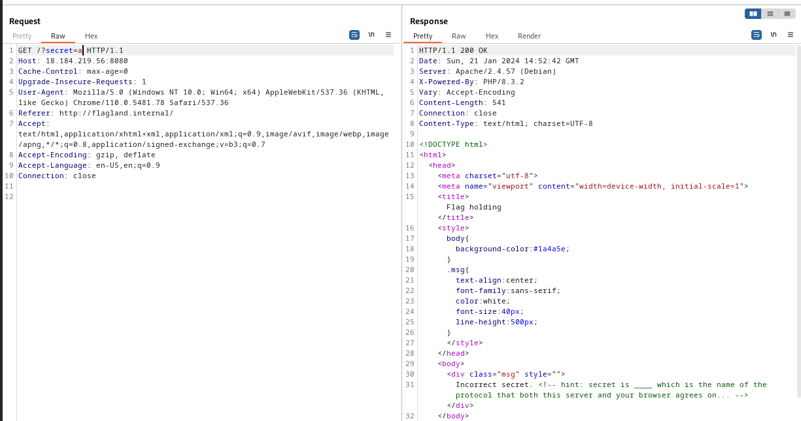

# MapnaCTF 2024 

---

### Web: Flag Holding

Переходим на сайт и видим, что нам сообщают о том, что мы додны обращаться к ресурсу относительно `http://flagland.internal/`:


Перехватываем запрос через BurpSuite и вставляем `Referer: http://flagland.internal/`

> Подробнее на HackTricks: https://book.hacktricks.xyz/network-services-pentesting/pentesting-web/403-and-401-bypasses


Далее нам сообщают о том, что мы не установили параметр "secret"


Обозначим его и присвоим какое-либо значение:



Как видим, у нас появилась подсказка с пропущенными словами. Отгадываем словами `http` и `flag` и пытаемся их подставить:


`MAPNA{533m5-l1k3-y0u-kn0w-h77p-1836a2f}`

---

### Web: Novel reader

Переходим на сайт и замечаем "библиотеку" с публичными и приватными историями. При этом у нас также есть какой-то баланс слов и денежных средств


Также у нас есть исходники:


Среди исходного кода находим следующее:


```sh
http://3.64.250.135:9000/api/read/public/A-Sad-Tale.txt
```

При этом мы не можем просто так прочитать секретную историю (так как она находится в директории `/private`, а не `/public`)


Снова обращаемся к исходникам и понимаем следующее: ***unquote*** - функция из urlib.parse, которая способна декодировать URL, но при этом, только одноуровнево, например `/../` -> `%2F%2e%2e%2F`. Многоуровневое URL-кодирование позволяет обойти данный вид защиты -> `%252F%252e%252e%252F`

Получается, для того, чтобы достать `flag.txt`, нам надо полняться на 2 директории выше, миновав `stuff/public/`

```sh
Варианты решений:

1) http://3.64.250.135:9000/api/read/public%252F%252e%252e%252F%252e%252e%252Fflag.txt

2) http://3.64.250.135:9000/api/read/public/%252e%252e/%252e%252e/flag.txt
```


`MAPNA{uhhh-1-7h1nk-1-f0r607-70-ch3ck-cr3d17>0-4b331d4b}`

---

### Web: Novel reader 2

Здесь у нас тот же сервис, что был и в первом задании.


Суть заключается в том, что нам надо добиться минимального отрицательного баланса 


И применяем технику из прошлого таска:

```sh
http://3.64.250.135:9000/api/read/public/%252e%252e/private/A-Secret-Tale.txt
```


`MAPNA{uhhh-y0u-607-m3-4641n-3f4b38571}`

---

### Forensics: PLC I


Расположение частей:

Пакет №35 -> MAPNA{y
Пакет №50 -> 0U_sHOu
Пакет №19 -> Ld_4lW4
Пакет №39 -> yS__CaR
Пакет №31 -> 3__PaAD
Пакет №46 -> d1n9!!}

`MAPNA{y0U_sHOuLd_4lW4yS__CaR3__PaADd1n9!!}`

---
