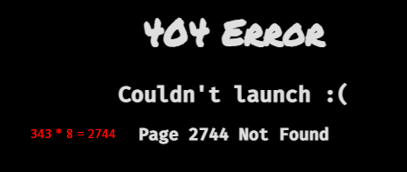

# MireaCTF 1 (06.11.2022)

---

## Task 1: Date Service

Заходим на сайт и нажимаем на кнопку «Get Date». После чего видим появившуюся дату:

Зайдем в инспектор и посмотрим на исходный код страницы. Из интересного сразу бросается в глаза скрытый «input» (hidden):

Попробуем ввести в поле «value» другое значение, например, «whoami» (проверка на RCE – Remote code execution – удаленное внедрение кода на сервере):

В итоге получаем ответ «user», что означает наличие RCE:

Далее посмотрим, какие команды нам доступны, при помощи ввода «help»:

Список команд:

После этого пробуем ввести «ls», но результата не получаем, поэтому попробуем «echo \*»:

Как итог, «echo \*» сработал, а это означает, что мы находимся в командной оболочке Bash. Осталось только прочитать флаг.

Флаг: flag{4n07h3r_w4y_t0_r34d_7h3_f1l3}

---

## Task 2: On takeoff! – Part 1

Переходим по ссылке и видим стартовую страницу:

Попробуем перейти в какую-нибудь другую директорию. Переходим видим 404, но после слова Page, вывелась директория, в которую мы хотели перейти. Попробуем вместо директории ввести что-то по интереснее. Ориентируемся на шаблон:

Вводим выражение:

Результат – вычисление введенного выражения:

Впишем в URL `{{ config.items() }}`, в результате получим словарь с конфигурационными значениями flask.

Если до вас никто не решал этот таск, то у вас будет меньше значений, так как еще никто не подключил библиотеку os.

Далее пишем `{{ ''.__class__.__mro__ }}`, это выведет список существующих классов (впереди две одинарные кавычки):

Нам нужны подклассы класса object, пишем `{{''.__class__.__mro__[1].__subclasses__() }}`

Получаем список, в нем ищем что-то, что позволит исполнять команды. В данном случае это **subprocess.Popen**

Теперь нужно узнать какой у него номер в этом списке. Для этого пишем `{{''.__class__.__mro__[1].__subclasses__()[266:] }}` и подбираем такое число, чтобы subprocess.Popen был в начале списка.

(не получилось)

Получается `{{ ''.\_\_class\_\_.\_\_mro\_\_[1].\_\_subclasses\_\_()[394:] }}`:

Теперь, когда мы нашли нужны класс, попробуем выполнить команду на сервере (RCE).

Команда исполнилась! Теперь найдем и прочитаем флаг:

Первый флаг мы получили! Но нам этого мало, нам нужно все.

Флаг: flag{py7h0n_fl45k_5s71}

---

Task 2: On takeoff! – Part 2

Повышаем привилегии. Проверяем, какие программы нам доступны с правами рута без пароля:

Видим, что мы можем запускать **/usr/bin/vim** от имени рута без пароля. Мы можем повысить свои привилегии с его помощью, так как он умеет выполнять системные команды.

Гуглим что-то вроде «vim privesc» и попадаем на сайт: https://gtfobins.github.io/gtfobins/vim/

Первый вариант нам подойдет, но если его вставить в URL, то получим ошибку, так как шаблонизатор не может обработать знаки.

Команда: `sudo /usr/bin/vim –c ‘:!ls /root/’` - её мы преобразуем в base64 и вставляем в наш шаблон:

Результат:

Обнаруживаем что страница долго висит, а потом падает в 504. Это происходит из-за того, что vim работает в интерактивном режиме, а браузер его не поддерживает. В итоге нам нужно переделать команду так, чтобы vim выполнял команду и закрывался без перехода в интерактивный режим. Немного изучив документацию vim’а у получается такая команда:

`sudo /usr/bin/vim --cmd ':!ls /root/' -ec 'qa!'` – её тоже в base64 и в шаблон

Результат:

Все работает! Забираем флаг

`sudo /usr/bin/vim --cmd ':!cat /root/root_flag.txt' -ec 'qa!'` - тоже в base64 и в шаблон

Флаг: flag{35c4p3_fr0m_v1m}

---
