# MireaCTF 2 (27.11.2022)

---

## Crypto 1: bacon_and_eggs

Описание:


Метод сокрытия секретного сообщения, придуманный Фрэнсисом Бэконом в начале XVII века. Он разрабатывал шифры, которые бы позволяли передавать секретные сообщения в обычных текстах так, чтобы никто не знал об этих сообщениях. Шифр базируется на двоичном кодировании алфавита символами «A» и «B», которым можно сопоставить «0» и «1». Затем секретное послание «прячется» в открытом тексте с помощью одного из способов сокрытия сообщений.


Флаг: MireaCTF{neverforgetaboutbasics}

---

## Crypto 2: evilxors

Описание:


Был сразу дан хинт всем участникам: **MireaCTF{}** – вам в помощь. Тогда приступаем. Заходим на dcode.fr и находим XOR. Первым делом вставляем в поле ключ-хинт:


Получили otshelnik, далее вставляем именно это слово в поле ключа и получаем флаг:


Флаг: MireaCTF{0td4l_l1_0n_k4m3n?}

---

## Crypto 3: kindxors

Описание:


Строка: 

```sh
32508610075453359044910791983298006166718142262640962687966102395183660122285261809198613272093724808234384301574
```

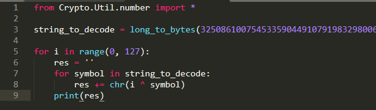

На самом деле таск не сложный. Принцип его таков, что мы сначала переводим long integer в byte string, при помощи функции long_to_bytes(). Далее берем поочередно символы от 0 до 127 по ASCII таблице и каждым символом производим XOR каждого байта строки, т.е. один символ ASCII XOR символ из строки string_to_decode. Получаем много строк, а потом среди них находим флаг.

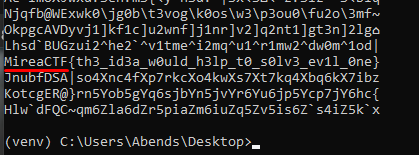

Флаг: MireaCTF{th3_id3a_w0uld_h3lp_t0_s0lv3_ev1l_0ne}

---

## Crypto 4: ancient

Описание:


Посмотрим, что находится в файле:


При просмотре файла можно увидеть, что структура крайне напоминает язык программирования. Гуглим, что же это может быть: **chinese programming language**

Вот и во второй ссылке видим слово «ancient»:


Переходим по второй ссылке, а затем в онлайн-компилятор:


Переносим код из файла и смотрим на результат выполнения:

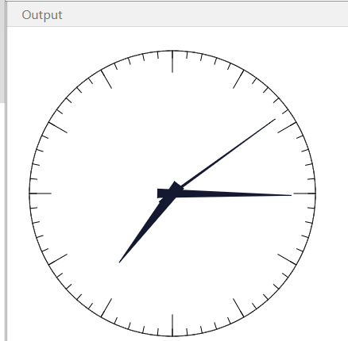

Получаем какие-то часы… но замечаем, что перед ними мелькнул какой-то текст. Чтобы его посмотреть, уберем setInterval() и снова запустим:

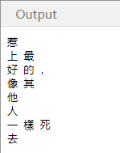

Интересно! А еще интересен тот факт, что эти символы и являются флагом.

Флаг: MireaCTF{惹 上 最 好 的 ，像 其 他 人 一 樣 死 去}

---

## Joy 1: Ilovethatfilm

Описание:


Откроем файл:


Выполним поиск по картинке и на одном из сайтов найдем название предмета вместе с названием фильма:


Флаг: MireaCTF{КодДаВинчи}

---

## net 1: packet

Описание:


Открываем файл и сортируем по протоколам:


Откроем первый ICMP-пакет:

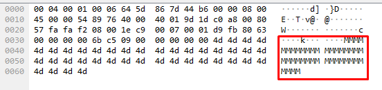

Интересно, а если дальше посмотреть? - Все пакеты смотрим с пометкой request (response их дублируют):

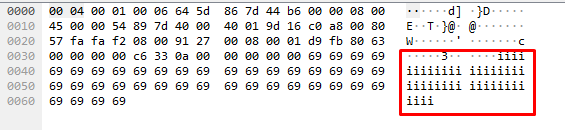

Ну думаю тут уже и так понятно, что мы скорее всего наткнулись на флаг, поэтому смотри до конца и забираем заветный флаг: MireaCTF{h0t_byt3s_@r3_s3nt}

---

## net 2: archivarius

Описание:


Откроем файл, затем нажмем ПКМ на первый протокол в списке захваченных, далее «Следовать» и «Поток TCP»:


Видим следующее:

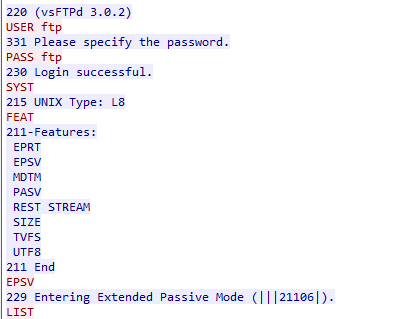

Продолжение:


Какой вывод можно сделать, проанализировав поток? Все просто: сначала пользователь проходит авторизацию, затем исследует директории, находит архив и скачивает его. В таком случае ищем, где происходит конкретно трансфер файла:


Откроем пакет №252:


Вот мы и нашли архив. Теперь снова на протоколе №252 ПКМ => «Следовать» и «Поток TCP»:


Честно сказать, дальше извлечь архив у меня не получилось, пришлось ждать разбора. Вся проблема у меня оказалась в разделе «Показать данные как…» - нужно было выбирать Raw (необработанный):


Сохраняем архив с расширением .7z и открываем:


Пароль **fuckit** – из rockyou.txt

Флаг: MireaCTF{n4tw0rk_1s_3v3rywh3reeeee}

---

## web 1: Secret Shop

Описание:


Открываем страницу и видим формы логина и регистрации, а также кнопку сброса:


Регистрируемся и входим. Далее перед нами появляется сам магазин из трех предметов: The Krysa, R1CK, flag. На балансе у нас 100$, чего недостаточно для покупки флага. Сам магазин: 


Посмотрим все последовательно через Burp Suite:


В логине ничего интересного нет, просто через input’ы передаются данные для авторизации, поэтому смотрим далее:


Покупаем The Krysa (product_id=1):


Подтверждаем покупку:


Получаем payment_id, т.е. подтвержденную транзакцию:

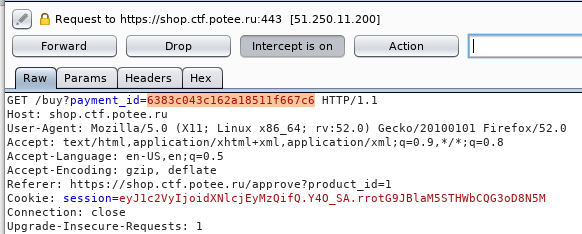

Теперь попробуем купить flag:


Получаем новый payment_id:

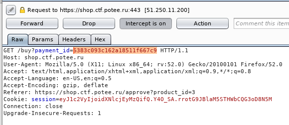

Теперь меняем новый payment_id на payment_id, который был от The Krysa:

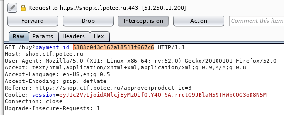

Удача! Мы купили flag:

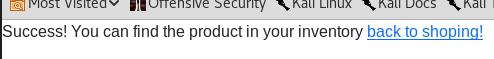

Заходим в профиль:


Флаг №1: MireaCTF{br0k3n_bu51n3s5_l0g1c}

У данного задания есть и продолжение, связанное с админской частью. Был дан хинт – «узнайте тайну создателя сайта». Мы в первой части регистрировали аккаунт с никнеймом user1234. Если попытаться зарегистрировать его еще раз, то получим предупреждение о том, что данный пользователь уже существует. Тогда попробуем ввести в поле логина admin:

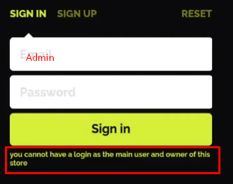

Также в чате была еще одна подсказка: «магазин написан не на SQL», что наводит на мысль о NoSQL.

В итоге здесь у нас должен эксплуатироваться SSJI (Server-Side JavaScript Injection). Попробуем следующее:

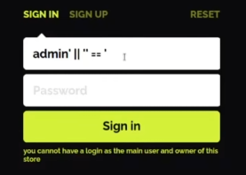

Поле логина не уязвимо, тогда переместим запись из логина в поле пароля:


В итоге мы смогли зайти:

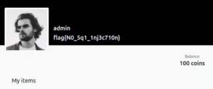

Флаг №2: MireaCTF{N0_Sq1_1nj3c710n}

Справка по SSJI в NoSQL доступна здесь: `https://www.securitylab.ru/analytics/534890.php` и здесь: `https://github.com/swisskyrepo/PayloadsAllTheThings/blob/master/NoSQL%20Injection/README.md`

---

## web 2: Domain check

Описание:


Заходим на сайт:

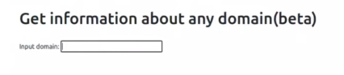

Попробуем ввести какой-нибудь сайт:


Получаем интересный вывод, который похож на вывод утилиты nslookup. Сравним с примером:


Это должно нас навести на мысль о том, что должна эксплуатироваться уязвимость RCE (Remote Code Execution). Попробуем проэксплуатировать:

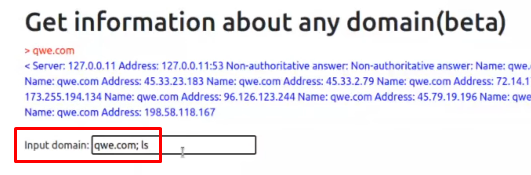

В выводе не видим «;», значит стоит фильтрация символов:

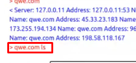

Далее переходим в исходный код страницы и находим следующий скрипт:


Вот мы и нашли фильтрацию, а еще видим, что соединение происходит по WebSocket, burp suite с этим работать умеет, поэтому перехватываем запрос:

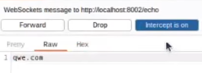

А ведь когда мы перехватили запрос, перед тем, как его отправить дальше, можно в нем написать то, что нам необходимо:

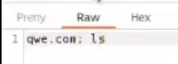

И система это примет! Результат:

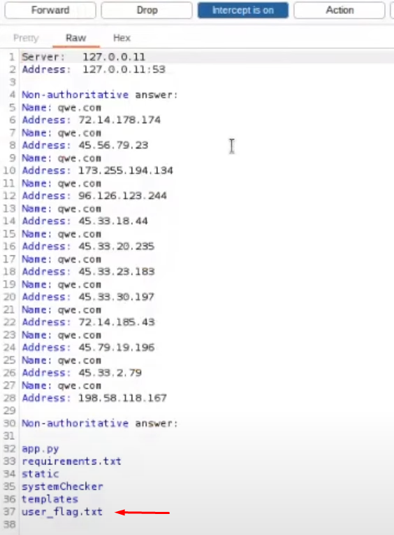

Вся суть здесь заключается в том, что js-фильтрацию запрос прошел перед перехватом, а мы дописали к запросу определенную часть уже после перехвата и отправили его дальше, соответственно, фильтрацию мы обошли.

Получим Reverse Shell (или Reverse TCP) — это схема взаимодействия с удалённым компьютером, при котором на удаленном компьютере запускается подключение к серверу, расположенному на локальном (которое используете вы). Данный тип подключения позволяет нам попасть в сеть, которая находиться за NAT и не имеет внешнего IP.

Используем ngrok. Ngrok - это сервис, который позволяет сделать локальный порт доступным из интернета без настройки NAT, роутера, DDNS и других протоколов. Программа создает туннель между вашим компьютером и удалённым сервером и предоставляет доступ к нему с уникального домена.


С помощью netcat слушаем, назначенный в ngrok порт:


Далее дописываем в запрос:

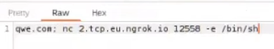

Флаг «–e» означает, что nc выполнит определенную команду после подключения. В нашем случае вернется /bin/sh - это путь к оболочке, отвечающей за выполнение команд и скриптов на Unix-системах.

После отправки запроса, подключение появилось:


Теперь читаем флаг:

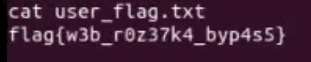

Флаг: MireaCTF{w3b_r0z37k4_byp4s5}

---

## web 3: Potee Cyber Talks

Описание:


Если смотреть через burp suite, то можно увидеть, что присутствует GET-запрос на получение favicon. Если посмотреть, как происходит получение, то можно понять, что это происходит через отдельный route.


В таком случае необходимо пробовать LFI (Local File Inclusion) - это возможность использования и выполнения локальных файлов на серверной стороне. Уязвимость позволяет удаленному пользователю получить доступ с помощью специально сформированного запроса к произвольным файлам на сервере, в том числе содержащую конфиденциальную информацию. Пробуем получить «самый популярный файл»:


Но видим, что присутствует фильтрация символов (static/etc/passwd):


Пробуем обойти фильтрацию добавлением еще по две точки:

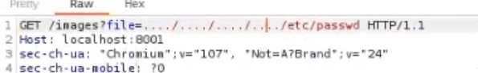

Результата нет. Видимо, фильтрация происходит именно по парам точек. Попробуем добавить ноль-байт (%00):  

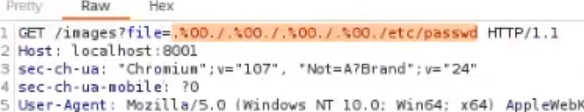

Собственно, результат:


Флаг: MireaCTF{10c4l_fi13_1nclu510n}

---

## web 4: Monitoring

Описание:


Открываем сайт:


Пробуем узнать статус:

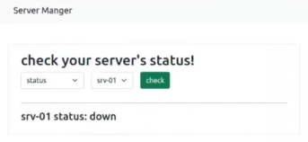

С помощью краулера узнаем, что есть директория /admin, открываем:

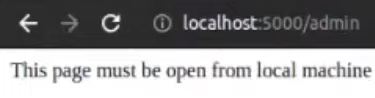

Перехватываем запрос:


Меняем по подсказке method и server:


Результат:


Флаг: MireaCTF{h3ll0_fr0m_l0c41_h057}

---

