# NimdaCTF (26.11.2022 - 27.11.2022)

---

## Task 1 (web): Server Side

Описание: обычно сервера посылают нам то, на что мы редко обращаем внимание.

Речь здесь как ни странно идет о request/response, что очевидно. Переходим по ссылке:

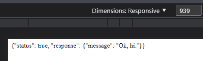

Заходим во вкладку «Network» в инспекторе и не обнаруживаем ничего интересного. Перезагружаем страницу и появляется ответ от сервера:

А в Response Headers лежит наш флаг:

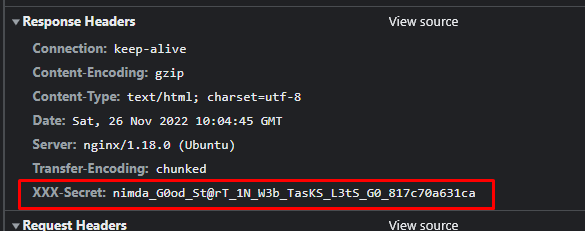

**Флаг**: nimda\_G0od\_St@rT\_1N\_W3b\_TasKS\_L3tS\_G0\_817c70a631ca

---

## Task 2 (stegano): Sanity

Описание: добро пожаловать на Nimda Late Autumn 2022.

У нас при переходе по ссылке скачивается картинка, откроем ее и посмотрим:

Первым делом нужно всегда заходить в «Свойства» файла, что и делаем и тут находим интересное:

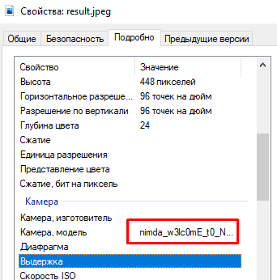

**Флаг**: nimda\_w3lc0mE\_t0\_N1mDa\_LaTe\_Autumn\_2o22\_8eebb133342a

---

## Task 3 (crypto): Long String

Описание: cклеим, плюнем, и в продакшн. Правда, должен подметить, что в этот раз криптозащита у нас получилась объемной.

Смотрим на содержание скачанного файла:

И правда – объемно получается. С подобным таском я уже сталкивался, поэтому подумал, что это base64 (как выяснилось я оказался прав). При декодировании строка base64 уменьшается в длине. В теории, мы должны сильно ужать строку, декодируя ее. Решил проверить теорию и написал python-скрипт:

Единственной проблемой остается вопрос числа повторов для декодирования, поэтому подставляем разные значения, почему же остановился на 20? Посмотрите сами:

Вот и в ступор я встал… Как видим, строка заметно уменьшилась, но что-то не хочет она полностью декодироваться. Проверим последний прошедший результат (строка перед «0\х95\х96с…») в dcode:

Ага! Base32! Вот она и ошибка. Решаем ее: 

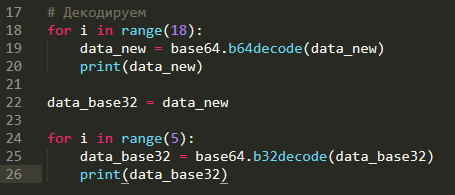

Запускаем:

И вот опять… По все видимости base32 есть только один раз… 

Тогда так:

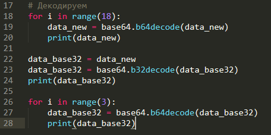

Да, в итоге флаг получен! Значит схема все такие следующая: base64 N-раз -> base32 1-раз -> base64 K-раз. Это все, конечно, хорошо, но вот только этот таск без разбора (если быть точнее - хинта), реализовать не получилось… Сам хинт в архиве со всеми заданиями:

В этом же архиве есть и код для решения, но пытался сделать сам, и в принципе это получилось сделать, вот только решение, которое находится в архиве, куда изящнее моего:

**Флаг**: nimda\_So\_L0nG\_StR1Ng\_Anb\_ShOR7\_Fl@G\_8417b7f932b8

---

## Task 4 (stegano): CenterBottom

Описание: недавно я смотрел классную анимку и хочу ее тебе порекомендовать. Я вырезал фрагмент чтобы ты глянул и убедился что она классная.

Скачиваем файл и просматриваем фрагмент японской мультипликации. Файл у нас с расширением .mkv. Посмотрим, что это за формат такой.

**mkv** - Мультимедийный контейнер Matroska - это свободный и открытый контейнерный формат, формат файла, который может содержать неограниченное количество дорожек видео, аудио, изображений или субтитров в одном файле. 

«mkv содержит субтитры» –> текст –> мб есть флаг. Проверим субтитры:

Меняем расширение с .mkv на .srt, а затем на .txt. Просматриваем файл на наличие флага:

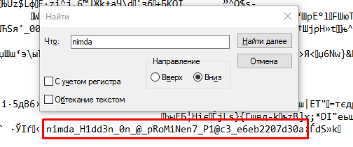

**Флаг**: nimda\_H1dd3n\_0n\_@\_pRoMiNen\_P1@c3\_e6eb2207d30a

---

## Task 5 (forensic): RocKYou

Описание: Отлавливали пакеты в офисе и наткнулись на что-то интересное. Что же это может быть? Наш криптограф говорит, что тут явно есть следы AES-256.

Открываем полученный файл в Wireshark и бегло просматриваем содержимое. Далее пробуем найти какие-либо HTTP-объекты (признаков других я не обнаружил):

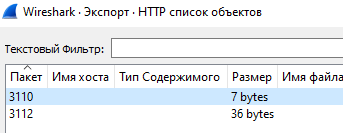

Видим, что нашлись два объекта, просмотрим их содержимое:

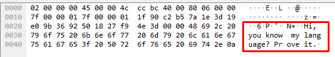

Интересно, теперь просмотри TCP Поток:

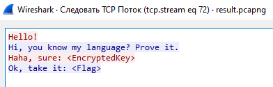

`**Небольшая справка**: «Результатом запуска TCP Потока будет установление соответствующего фильтра отображения пакетов. Wireshark откроет диалоговое окно с отфильтрованным набором TCP-пакетов в интересующем потоке. Эта возможность будет очень полезной, если, к примеру, мы пытаемся разобраться в потоке данных. Данная функциональность позволит нам увидеть протокол таким, каким его видит прикладной уровень приложения»

При просмотре пакетов в выделенном потоке можно заметить два интересных пакета с необычными комментариями:

**Encrypted\_Key**=000000100b15ae5c532d9ace70b56a6826029b23c1564b613009b95090773c0505a9303fffc2ae535f5e3ad4e84b0ec20d9f800cd1ff95411619fae2d473acc0a1435492ff2e6759192c5b3a8ea61f562864666535ed75016702d058561930aed8a55b3ee104ddafa3271d36bbc01aadffaf7a17d7397eb20e021891658bc32efd64b3095e9ccb47ef4dad7a8039c3105b80f1a8735274405f29cd622036b9a9246836f66977f1d3d72b9d3698f3917698709f1dcd0e7fac46318270449ccb6fc1b7c2c8

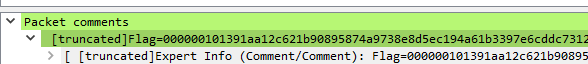

**Flag**=000000101391aa12c621b90895874a9738e8d5ec194a61b3397e6cddc7312650b8db91a162a02aa7cb510dc4a53b8f9f44f3b9ead68d4e43fda665b02ec6ccb7cb800c7036079df9b4a9d514ac90168f2a1a68cb9558c0b2121ba73b64dbe4c200ffd99bcf914174418c2b8577b26137302d73f9ffdc86c0408869633c3b1aeab1cbd7aec0f7974db1ec0bb4de033248771ff5ff3f165d702ab9f5a5cd093236f211b10fd7f599c59a334c08a2b1d9cc792e624c8702e7fc40b64b20ef40d07a2b42bf8cdbffdc27281c42ad368d8bfceb240625

Пока мы командой решали другие таски, появилось достаточно много хинтов на это задание:

1) «Следует обратить свой взор на название задания. Иногда в интернете можно найти то, чего ты не ждешь. Расшифруйте одно из двух и получите ключи ко всему»

**Размышления**: rockyou.txt является словарем паролей. Соответственно, если мы найдем пароль по этому словарю, то мы сможем расшифровать сообщение (флаг).

1) «Смотрите что именно вы расшифровываете. ОБЫЧНО зашифрованные данные AES это байты. А мы представляем их в других, печатаемых видах»

Размышления: Тут тоже все предельно ясно – наши **Flag** и **Encrypted\_key** представлены не в байтах, а в hex-формате.

2) «Уточняем шифр - AES-256-CBC»

**Размышления**: именно этот хинт явно должен помочь в дальнейшем.

3) «Библиотека в python, которая решает только эту задачу»

**Размышления**: Есть достаточное количество библиотек, пока не очень понятно.

4) «Библиотека - aes\_cipher»

**Размышления**: Окей, посмотрим, что к чему.

В итоге этот таск не решила ни одна команда, в том числе и наша, поэтому анализируем решение от создателей:

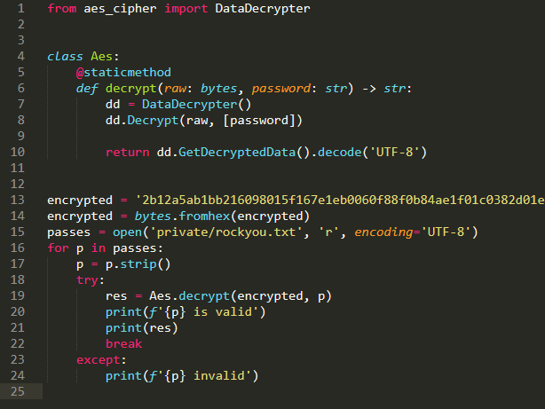

Суть в том, чтобы узнать пароль по словарю rockyou.txt, а уже при помощи этого пароля расшифровать флаг.

Флаг должен был быть: 

**nimda\_F0r3ns1c\_1s7\_G0oD\_For\_YouR\_l1f3\_[a-z0-9]{12}**

---

## Task 6 (crypto): Chorus

Описание: Давно тебя не было в уличных гонках. С тех самых пор мало что изменилось, разве что числа стали рандомнее.

Переходим по ссылке и смотрим файл, который у нас загрузился:

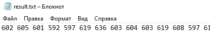

**Все числа**: 602 605 601 592 597 619 636 603 604 603 619 608 597 615 607 619 636 597 615 619 630 519 593 602 619 620 603 614 519 592 619 598 621 619 609 619 592 597 599 512 516 598 518 594 597 597 594 598

Теперь посмотрим на сам проект:

В функции generate() происходит XOR –> ord(x) ^ seed. Соответственно, все значения, которые мы впервые обнаружили в файле result.txt – это и было то, что генерировалось рандомно (seed = randint(1, 1024)).

Наша команда данный таск, к сожалению, не реализовала, поэтому разбираемся с решением от создателей:

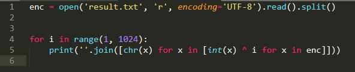

При запуске получаем все вариации с числами из файла, выделяем самую нормальную из всего набора непонятных символов: 146ae7g34437

**Флаг**: nimda\_Hoho\_TaSk\_HaS\_B3en\_XoR3d\_bY\_U\_146ae7g34437

---
