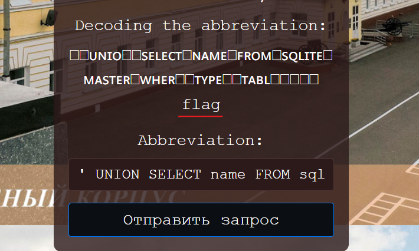
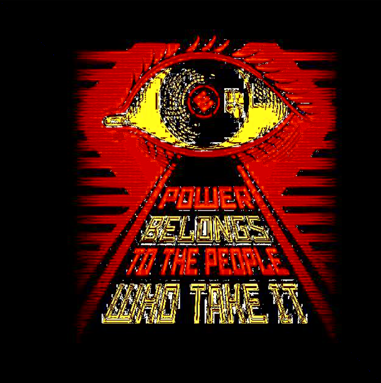
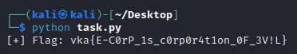

# VKACTF Kids 2023

---

### Task 1: Breakfast (web)

Переходим на сайт:


Регистрируем аккаунт и авторизуемся:


После входа приложение нас приветствует и предлагает получить флаг:


Но есть нюанс - мы не админ:


Находим в куках JWT-токен и смотрим на его структуру:


Нам необходимо всего лишь изменить поле с именем пользователя на "admin", но при этом мы не знаем парольную фразу для того, чтобы правильно подписать токен. Попробуем перебрать парольные фразы через **rockyou.txt** и **JWT_tool**


В итоге получаем, что парольная фраза - **P@ssw0rD**

Изменяем токен:


Вставляем его в куки:


И забираем флаг:


Flag: **vka{jwT_TOken_In_CooKi35}**

---

### Task 2: SVUDB (web)

При переходе на ресурс нас встречает единственное поле ввода, где проверяются аббривиатуры:


Поле ввода уязвимо к SQLi:


Опытным путем узнаем, что БД работает на основе SQLite3:

```sql
' UNION SELECT name FROM sqlite_master WHERE type='table' --
```



В БД находим таблицу **flag** и забираем нее все содержимое

```sql
' UNION SELECT * FROM flag --
```


Flag: **vka{military_schools_db_without_protection}**

---

### Task 3: Encaptcha (ppc/misc)

Перед нами сервис, который требует от нас 1337 правильных ответов:


Разберем данный таск на примере кода, предоставленного автором:

```python
import requests
from bs4 import BeautifulSoup
import re
import base64

# Создание сессии для того, чтобы результат сохранялся
s = requests.Session()
response = s.get("https://encaptcha.vkactf.ru/")

i = 0
while i < 1337:
    try:
        print(i)
        soup = BeautifulSoup(response.text, "html.parser")
	
	# Парсим станицу для того, чтобы найти элемент с заданием:
        h1_tags = soup.find_all("h1")
        enc_data = h1_tags[1].string[12:]
	
	# Выводим номер челенджа и его содержимое
        print(f"[+] Challenge {i + 1}: {enc_data}")
	
	# Далее идет проверка через регулярные выражения на наличие строк формата base16, base32, base64 и base85, а также их декодирование с последующим решением простого математического выражения через функцию eval()
        if re.search(r"[#$%&()*~`@><{}?_|!;+^-]", enc_data):
            data = eval(base64.b85decode(enc_data).decode())
            print(f"Base85 {data}")
            response = s.post("https://encaptcha.vkactf.ru/", data={"answer": data})
        elif re.search(r"[a-z]", enc_data):
            data = eval(base64.b64decode(enc_data).decode())
            print(f"Base64 {data}")
            response = s.post("https://encaptcha.vkactf.ru/", data={"answer": data})
        elif re.search(r"G[A-Z]*|=", enc_data):
            data = eval(base64.b32decode(enc_data).decode())
            print(f"Base32 {data}")
            response = s.post("https://encaptcha.vkactf.ru/", data={"answer": data})
        else:
            data = eval(base64.b16decode(enc_data).decode())
            print(f"Base16 {data}")
            response = s.post("https://encaptcha.vkactf.ru/", data={"answer": data})
        i += 1
    except:
        response = s.get("https://encaptcha.vkactf.ru/")
        continue

response = s.get("https://encaptcha.vkactf.ru/")

# Печатаем ответ
print(f"[+] Response: {response.text}")
```

В итоге получаем флаг:


Flag: **vka{C0NGRAt5_You_bUT_iT_w45_r3aLlY_34zY}**

---

### Task 4: Encoder (rev)

Дана картинка, которая с виду битая или что-то подобное:



```python
from PIL import Image
image_path = "data.png" 
img = Image.open(image_path)
pos = [564, 872, 1210, 178, 1170, 128, 26, 424, 10, 468, 766, 712, 870, 1176, 454, 1150, 1078, 400, 1114, 1106, 1206, 1016, 1234, 382, 138, 804, 578, 412, 796, 144, 148, 368, 736, 724]
pixels = img.load()

flag = []

# По позициям получаем пиксели, берем r,g,b и в chr() помещаем значение синего оттенка

for y in range(len(pos)):
    x, y = int(pos[y] / 2), int(pos[y] / 2)
    r, g, b = img.getpixel((x, y))
    flag.append(chr(pixels[x, y][2]))

flag = "".join(flag)
print(f"[+] Flag: {flag}")
```



vka{E-C0rP_1s_c0rp0r4t1on_0F_3V!L}

---

