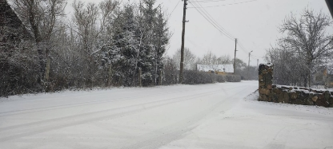

# VU Cyberthon 2023

---

## Task 1 – Simple Web

Дан файлик с расширением .html, при открытии которого происходит редирект и открывается страница мероприятия. В таком случае заглянем внутрь:

Собственно, из странного видим последовательность символов в поле WWW-Authenticate. Скорее всего brainfuck. Проверяем:

Флаг: VU{cyberthon}

---

## Task 2 – Find Location

Дан файл с картинкой:

Название намекает нам на поиск локации. На самом же деле картинка запутывает. Зайдем на Aperi’Solve (https://www.aperisolve.com) и посмотрим метаданные:

Флаг: VU{d5bc0961009b25633293206cde4ca1e0}

---

## Task 3 – Blue Baby Shark

С помощью WireShark открываем файл с дампом трафика, который приложен к заданию. Сам дамп довольно объёмный – в нем много «повторяющихся» моментов, внутри которых ничего обнаружить при беглом осмотре не удалось. Из подсказок у нас только тот факт, что одна из машин была скомпрометирована.

Далее файл был проверен на наличие объектов, но их обнаружить не удалось. В таком случае рассматриваем потоки, но перед этим «перепрыгнем» этап захвата – отсортируем пакеты следующим образом:

В UDP ничего интересного. Применим фильтр для TCP:

ПКМ по первой найденной записи => Следовать => Поток TCP. Он у нас определился как 15046. Вот мы и нашли элемент компрометации по подсказке, а вместе с тем и флаг:

Флаг: VU{b4by\_5h4rk\_fly\_4w4y}

---

## Task 4 - RFC standard for security policy information

В описании написано, что литовская компания Altacom использует RFC стандарт для быстрого обмена информации об уязвимостях на своем ресурсе.

Находим сайт самой компании - https://www.altacom.eu/

Смотрим, что это за стандарт - https://www.rfc-editor.org/rfc/rfc9116

Самое интересное это то, что при использовании такого стандарта появляется файл security.txt, который находится в директории /.well-known/, где должна быть указана контактная информация, которая нам и нужна.

Ссылка: https://www.altacom.eu/.well-known/security.txt

Флаг: VU{report@altacom.eu}

---

## Task 5 - Challenge – Firewall

Для выполнения данного таска понадобится инструмент Registry Explorer (v2.0.0.0) (возможно понадобится обновит .NET framework). Разахивируем в какую-нибудь папку и открываем. Далее открываем файл all-firewall-rules.txt (Ctrl + O) и переходим в раздел FirewallRules:

Далее просматриваем на наличие странных записей и находим следующее:

Декодируем сообщение из base64:

Флаг: VU{cyberthon23}

---

